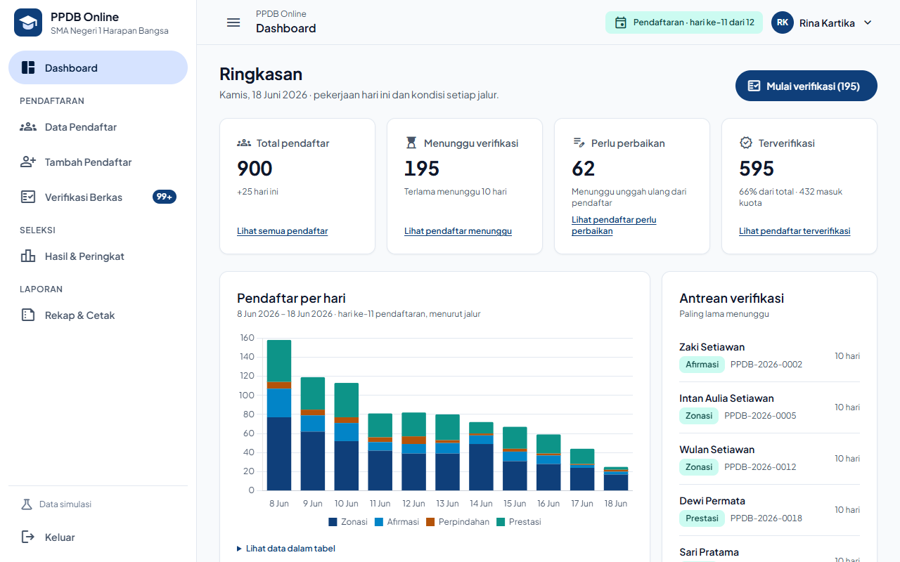
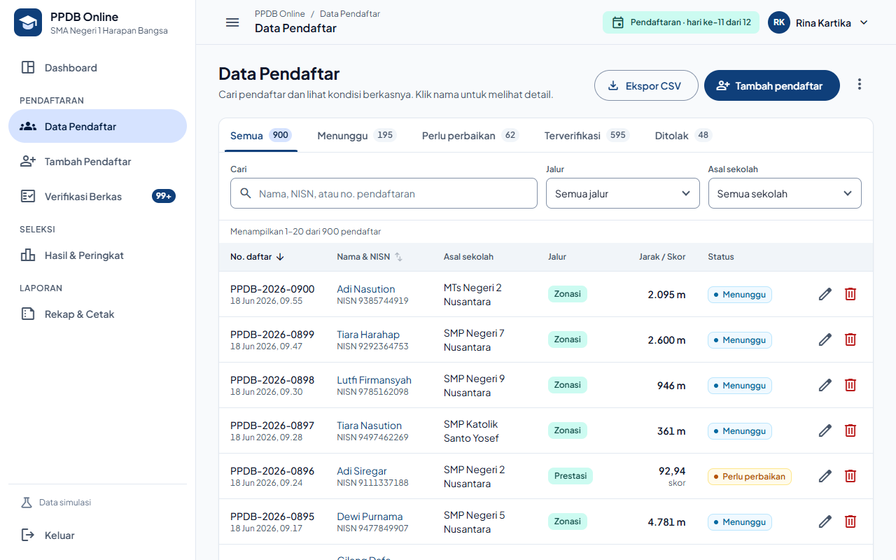
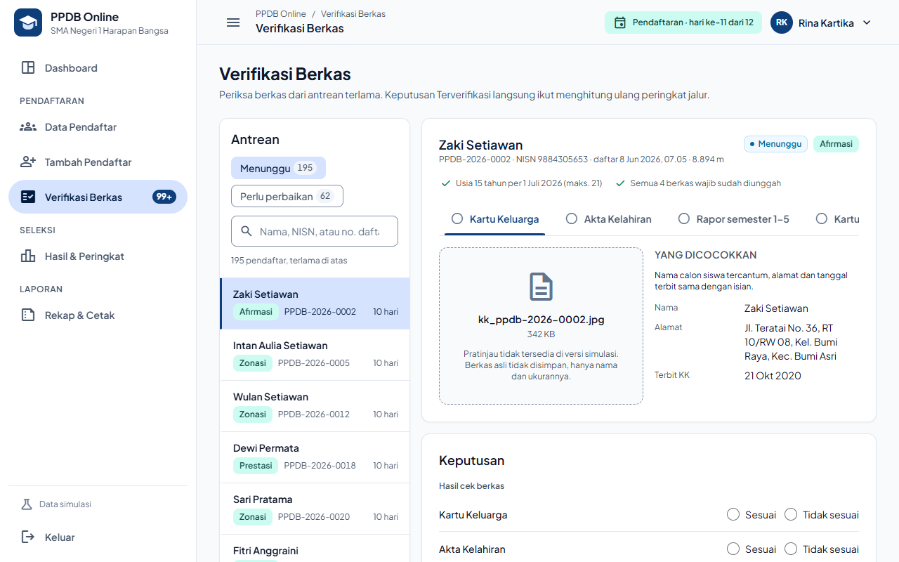
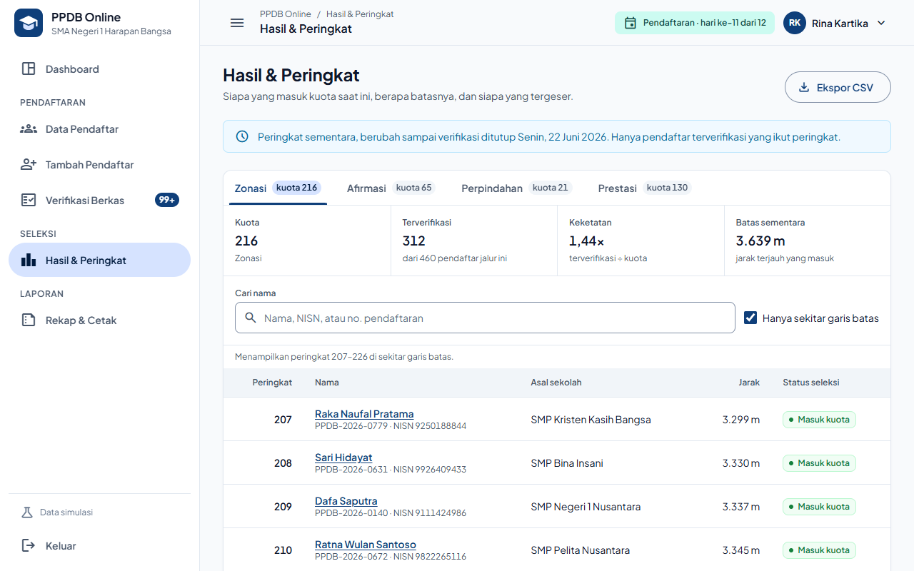
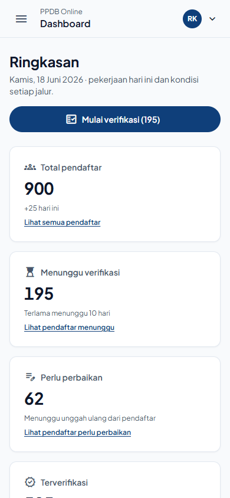

# Admin Panel PPDB Online

[](https://github.com/nurdinrhk-design/PROGRAMWEB_2/actions/workflows/ci.yml)

Admin Panel (back-office) **Penerimaan Peserta Didik Baru** untuk panitia sekolah: memantau pendaftar, memverifikasi berkas, melihat peringkat per jalur, dan mencetak rekap. Murni *client-side* (HTML, CSS, JavaScript) dengan tema **Material Design 3**.

**🌐 Coba langsung:** <https://nurdinrhk-design.github.io/PROGRAMWEB_2/> · akun demo `panitia` / `ppdb2026`

> ⚠️ **Data simulasi.** Sekolah "SMA Negeri 1 Harapan Bangsa", nama siswa, dan semua angka di aplikasi ini **fiktif**. Aplikasi tidak memakai data siswa asli dan tidak diindeks mesin pencari.



## Identitas Tugas

| | |
|---|---|
| **Nama** | Nurdin |
| **GitHub** | [@nurdinrhk-design](https://github.com/nurdinrhk-design) |
| **Mata kuliah** | Pemrograman Web 2 (Client-Side Programming) |
| **Tugas** | Tugas 1 · Project-Based Learning |
| **Topik** | Sistem Penerimaan Peserta Didik Baru (PPDB Online) |
| **Tema visual** | Material Design 3 |
| **Desain** | [Proyek Google Stitch](https://stitch.withgoogle.com/projects/7419386921328695791) (referensi, lalu diperbaiki) |

## Status Milestone

| Milestone | Isi | Status | Tautan |
|---|---|---|---|
| **M1** · Perencanaan & wireframe | Menu, ERD, user flow, wireframe, design system | ✅ Selesai | [docs/perancangan.md](docs/perancangan.md) |
| **M2** · Slicing & layouting | Design token, komponen CSS, template dasar | ✅ Selesai | [layout.html](layout.html) · [docs/styleguide.html](docs/styleguide.html) |
| **M3** · Komponen & interaktivitas | 8 halaman admin + JavaScript + deploy | ✅ Selesai ([v1.0](https://github.com/nurdinrhk-design/PROGRAMWEB_2/releases/tag/v1.0)) | [Situs](https://nurdinrhk-design.github.io/PROGRAMWEB_2/) · [docs/checklist_work.md](docs/checklist_work.md) |

## Fitur

| Halaman | Isi |
|---|---|
| **Login** | Validasi per kolom, batas 5 percobaan, "Ingat saya", halaman admin terkunci tanpa sesi |
| **Dashboard** | 4 angka utama yang menaut ke data, grafik pendaftar per hari per jalur (+ tabel data), keketatan jalur, 5 antrean terlama, jadwal PPDB |
| **Data Pendaftar** | Tab status, cari, filter berlapis, urutkan, paginasi, kartu di HP, detail, hapus + "Urungkan", ekspor CSV, cadangan & pemulihan JSON, kembalikan data awal |
| **Tambah/Ubah Pendaftar** | Form 4 langkah dengan validasi aturan PPDB (NISN unik, usia ≤ 21 tahun, KK zonasi ≥ 1 tahun, nilai, berkas), berkas wajib mengikuti jalur, rata-rata rapor otomatis, ringkasan, peringatan sebelum keluar |
| **Verifikasi Berkas** | Antrean terlama dulu, cek per berkas dengan data pembanding, Terverifikasi hanya bila semua sesuai, catatan wajib untuk Perbaikan/Tolak, lanjut otomatis ke pendaftar berikutnya |
| **Hasil & Peringkat** | Per jalur: kuota, keketatan, batas sementara, garis batas kuota, cari nama yang langsung disorot, ekspor CSV |
| **Rekap & Cetak** | Filter periode & jalur, rekap per jalur, 10 asal sekolah terbanyak, rekap harian, log aktivitas, ekspor CSV, cetak A4 |
| **Bukti Pendaftaran** | Siap cetak A4, tanpa lambang, stempel, QR, atau tanda tangan palsu |

| Data Pendaftar | Verifikasi Berkas |
|---|---|
|  |  |
| **Hasil & Peringkat** | **Tampilan HP** |
|  |  |

## Aturan PPDB yang diterapkan

- **4 jalur, kuota 432:** Zonasi 216 · Afirmasi 65 · Perpindahan Tugas Orang Tua 21 · Prestasi 130.
- **Peringkat:** hanya pendaftar terverifikasi. Jalur jarak: terdekat → usia lebih tua → daftar lebih awal. Jalur prestasi: skor (rata-rata rapor semester 1–5 + bonus kota/provinsi/nasional +2/+3/+5) tertinggi.
- **Keketatan** = terverifikasi ÷ kuota. **Batas sementara** = jarak/skor peringkat terakhir yang masuk kuota.
- Perubahan data yang memengaruhi seleksi pada pendaftar yang sudah diperiksa → status kembali **Menunggu** untuk verifikasi ulang.

Rincian aturan BR-01…BR-13 ada di [perencanaan §7](docs/perencanaan.md#7-model-data--aturan-bisnis).

## Teknologi

| Bagian | Teknologi |
|---|---|
| Struktur | HTML5 semantik |
| Tampilan | CSS3 murni, modular, berbasis design token (tanpa framework) |
| Interaksi | JavaScript murni (tanpa framework, tanpa proses build) |
| Grafik | Chart.js 4.5.1 dari jsDelivr, versi dikunci + Subresource Integrity, dimuat asinkron |
| Font & ikon | Plus Jakarta Sans · Material Symbols Outlined (Google Fonts) |
| Data | `localStorage` + 900 data simulasi dari generator ber-*seed* |
| Hosting & CI | GitHub Pages · GitHub Actions (W3C Nu Validator + Gitleaks) |

## Kualitas & Keamanan

| Pemeriksaan | Hasil |
|---|---|
| Uji otomatis | 152 uji halaman & modul inti + 27 uji QA, lulus di Chrome dan Edge |
| Kasus uji fungsional | 23/23 lulus ([daftar TC](docs/checklist_work.md)) |
| Lighthouse | Aksesibilitas **100** · Praktik terbaik **100** di 8 halaman |
| Validator W3C | 0 error HTML & CSS (juga dicek CI di setiap push) |
| Responsif | 360 · 600 · 840 · 1200 · 1440 px tanpa scroll horizontal |
| Keamanan front-end | Tanpa `innerHTML` untuk data (anti-XSS), Content-Security-Policy, SRI, pengaman *formula injection* CSV, validasi impor ketat, anti *open-redirect*, batas percobaan login |
| Repo publik | Audit rahasia sebelum setiap push + Gitleaks di CI; commit memakai email *noreply* |

Login di aplikasi ini **simulasi** (akun sengaja dipublikasikan). Untuk PPDB sungguhan, autentikasi dan data harus berada di server.

## Cara Menjalankan

**Online:** buka <https://nurdinrhk-design.github.io/PROGRAMWEB_2/>.

**Di laptop** (tanpa instalasi atau proses build):
1. Clone repositori:
   ```bash
   git clone https://github.com/nurdinrhk-design/PROGRAMWEB_2.git
   ```
2. Buka `index.html` di browser (klik dua kali), atau jalankan **Live Server** di VS Code.
3. Masuk dengan `panitia` / `ppdb2026`.

Butuh internet untuk font, ikon, dan grafik. Tanpa internet aplikasi tetap berjalan; grafik diganti tabel. Data tersimpan di browser masing-masing; kembalikan ke awal lewat *Data Pendaftar → menu ⋮ → Kembalikan data awal simulasi*. Uji modul inti bisa dibuka di `tests/index.html`.

## Struktur Folder

```
PROGRAMWEB_2/
├── index.html              # Login
├── 404.html                # Halaman tidak ditemukan (GitHub Pages)
├── layout.html             # Template master (M2)
├── assets/
│   ├── css/                # main.css → tokens, base, layout, components, pages, print
│   ├── js/core/            # rules (aturan PPDB), seed (data simulasi), store (data), ui, shell (login & navigasi)
│   ├── js/pages/           # satu skrip per halaman
│   └── img/                # logo.svg
├── pages/                  # dashboard, data-master, form, verifikasi, hasil-seleksi, laporan, bukti
├── tests/                  # uji otomatis modul inti (buka index.html di browser)
├── docs/                   # perancangan (M1), perencanaan, checklist, styleguide (M2), presentasi, panduan domain
└── .github/workflows/      # CI: validasi W3C + pemindaian rahasia
```

## Dokumentasi

- [Perancangan (M1)](docs/perancangan.md): menu, sitemap, user flow, ERD, wireframe, design system.
- [Perencanaan](docs/perencanaan.md): keputusan, kebutuhan, aturan bisnis, tahapan, strategi pengujian.
- [Checklist pekerjaan](docs/checklist_work.md): status setiap langkah, hasil uji, log perubahan file.
- [Naskah demo & tanya-jawab](docs/presentasi.md): bahan presentasi 5–7 menit.
- [Panduan domain](docs/panduan-domain.md): memasang domain sendiri (DNS, HTTPS).

---

© 2026 Nurdin · Dibangun oleh Nurdin bersama Claude (AI dari Anthropic) untuk tugas mata kuliah Pemrograman Web 2.
