# Perancangan Admin Panel PPDB Online

**Milestone 1 · Perencanaan Menu & UI Wireframing**

| | |
|---|---|
| **Mata kuliah** | Pemrograman Web 2 (Client-Side Programming) |
| **Tugas** | Tugas 1 · Project-Based Learning |
| **Pengembang** | Nurdin (`nurdinrhk-design`) |
| **Topik** | Sistem Penerimaan Peserta Didik Baru (PPDB Online), sisi admin |
| **Sekolah (fiktif)** | SMA Negeri 1 Harapan Bangsa, Kota Nusantara · Tahun Ajaran 2026/2027 |
| **Tema visual** | **Material Design 3** |
| **Desain (Google Stitch)** | _Tautan publik menyusul (T1-17), lihat [§8.2](#82-dari-desain-ke-kode)_ |
| **Repositori** | [github.com/nurdinrhk-design/PROGRAMWEB_2](https://github.com/nurdinrhk-design/PROGRAMWEB_2) |

> Semua nama sekolah, siswa, dan angka di dokumen ini adalah **data simulasi**. Aturan kerja dan keputusan teknis yang lebih rinci ada di [perencanaan.md](perencanaan.md).

## Daftar Isi
1. [Ringkasan Sistem](#1-ringkasan-sistem)
2. [Tema Visual & Prinsip Desain](#2-tema-visual--prinsip-desain)
3. [Arsitektur Informasi](#3-arsitektur-informasi)
4. [User Flow](#4-user-flow)
5. [Rancangan Data (ERD)](#5-rancangan-data-erd)
6. [Wireframe Halaman](#6-wireframe-halaman)
7. [Design System](#7-design-system)
8. [Proses Desain](#8-proses-desain)

---

## 1. Ringkasan Sistem

**Masalah.** Selama 12 hari pendaftaran, panitia PPDB menerima ratusan pendaftar untuk **432 kursi**. Setiap hari panitia harus memeriksa berkas, memantau jalur mana yang paling ketat, mengetahui siapa yang masuk dan siapa yang tergeser dari kuota, lalu membawa rekap ke rapat.

**Solusi.** Admin Panel yang menjawab tiga pertanyaan kerja harian:
1. *Apa yang harus saya kerjakan dulu?* → antrean verifikasi, diurutkan dari yang paling lama menunggu.
2. *Bagaimana kondisi seleksi saat ini?* → keketatan dan batas nilai/jarak sementara per jalur.
3. *Apa yang saya bawa ke rapat?* → rekap siap cetak.

**Pengguna.** Satu peran: **Panitia PPDB (verifikator)**.

**Batasan.** Aplikasi berjalan sepenuhnya di browser (HTML, CSS, JavaScript) dengan data simulasi di `localStorage`. Tidak ada server, sehingga integrasi Dapodik/Dukcapil, peta GPS, dan notifikasi WhatsApp **sengaja tidak ditampilkan** agar tidak memberi kesan palsu.

---

## 2. Tema Visual & Prinsip Desain

### 2.1 Mengapa Material Design 3
| Kebutuhan aplikasi panitia | Jawaban Material Design 3 |
|---|---|
| Dipakai berjam-jam untuk memeriksa data | Latar terang netral, kontras teks tinggi, tanpa efek dekoratif yang melelahkan |
| Banyak tabel dan form | Komponen M3 sudah teruji untuk data padat: text field, data table, chip, dialog |
| Harus jelas mana aksi utama | Hierarki tombol M3: *filled* → *tonal* → *outlined* → *text* |
| Status harus cepat terbaca | Peran warna M3 dipisah dari warna status |
| Dipakai di laptop maupun HP | Navigasi adaptif M3: drawer → rail → drawer modal |

Tiga tema lain dipertimbangkan, tetapi tidak dipilih:
- **Glassmorphism:** kontras teks di atas kaca buram menurun saat tabel padat.
- **Neumorphism:** batas komponen terlalu samar untuk form panjang.
- **Skeuomorphism:** kesannya berat dan tidak cocok untuk aplikasi data.

### 2.2 Ciri M3 yang diterapkan
- **Peran warna:** `primary`, `primary-container`, `secondary`, `surface`, `surface-container`, `outline`.
- **Tonal elevation:** kartu dibedakan dengan warna permukaan dan garis tipis, bukan bayangan tebal.
- **State layer:** lapisan transparan 8–10% saat hover, fokus, dan ditekan.
- **Shape scale:** tombol berbentuk pil, chip dan input 8px, kartu 12px, dialog 16px.
- **Navigasi adaptif:** navigation drawer (≥ 1200px), navigation rail (600–1199px), drawer modal (< 600px).
- **Komponen khas:** top app bar, snackbar dengan aksi "Urungkan", stepper, dan ikon Material Symbols.

### 2.3 Prinsip "tanpa AI slop"
Desain awal dibuat dengan bantuan Google Stitch (lihat [§8.1](#81-google-stitch)). Hasil AI seperti itu cenderung penuh elemen yang *tampak* canggih tetapi tidak berguna. Karena itu setiap halaman harus lolos prinsip berikut:

| Prinsip | Artinya |
|---|---|
| Tidak ada fitur atau metrik palsu | Tidak ada "latensi API", "akurasi OCR", atau "server sinkron 100%" |
| Setiap angka bisa ditelusuri | Semua angka dihitung dari data, tidak ada yang ditulis manual |
| Setiap elemen menjawab pertanyaan panitia | Elemen yang tidak menjawab pertanyaan apa pun dibuang |
| Satu aksi utama per halaman | Hanya satu tombol *filled* |
| Warna = makna | Hijau, kuning, merah, dan biru hanya dipakai untuk status |
| Jujur tentang simulasi | Identitas fiktif, label "Data simulasi", tanpa stempel/tanda tangan/QR palsu |
| Konsisten | Satu nama sekolah, satu format tanggal (`18 Jun 2026`), satu format nomor (`PPDB-2026-0001`) |

---

## 3. Arsitektur Informasi

### 3.1 Hierarki menu (navigation drawer)

```
PPDB Online · SMAN 1 Harapan Bangsa
│
├── Dashboard
│
├── PENDAFTARAN
│   ├── Data Pendaftar
│   ├── Tambah Pendaftar
│   └── Verifikasi Berkas ········ [badge: jumlah menunggu]
│
├── SELEKSI
│   └── Hasil & Peringkat
│
├── LAPORAN
│   └── Rekap & Cetak
│
└── (bagian bawah) Data simulasi · Keluar
```

| Menu | File | Pertanyaan yang dijawab |
|---|---|---|
| Dashboard | `pages/dashboard.html` | Berapa pekerjaan hari ini, jalur mana yang paling ketat? |
| Data Pendaftar | `pages/data-master.html` | Di mana data pendaftar X dan bagaimana statusnya? |
| Tambah Pendaftar | `pages/form.html` | Bagaimana menginput pendaftar yang datang langsung? |
| Verifikasi Berkas | `pages/verifikasi.html` | Berkas siapa berikutnya, dan apakah sah? |
| Hasil & Peringkat | `pages/hasil-seleksi.html` | Siapa yang masuk kuota, berapa batasnya? |
| Rekap & Cetak | `pages/laporan.html` | Apa yang dibawa ke rapat panitia? |
| *(tidak di menu)* Bukti Pendaftaran | `pages/bukti.html?id=…` | Tanda terima untuk pendaftar, dibuka dari detail pendaftar |
| *(di luar panel)* Login | `index.html` | Masuk ke sistem |

**Keputusan menu:**
- **Badge hanya di "Verifikasi Berkas"**, karena hanya menu itu yang menuntut tindakan.
- **Menu dikelompokkan mengikuti alur kerja PPDB:** Pendaftaran → Seleksi → Laporan.
- **Setiap menu punya halaman yang berfungsi.** Tidak ada menu "Pengaturan" atau "Integrasi" yang kosong.

### 3.2 Top app bar
Isinya hanya empat elemen:
1. Tombol menu
2. Judul halaman + breadcrumb
3. Chip tahap PPDB ("Pendaftaran · hari ke-9 dari 12")
4. Avatar panitia (menu: nama, peran, Keluar)

### 3.3 Sitemap

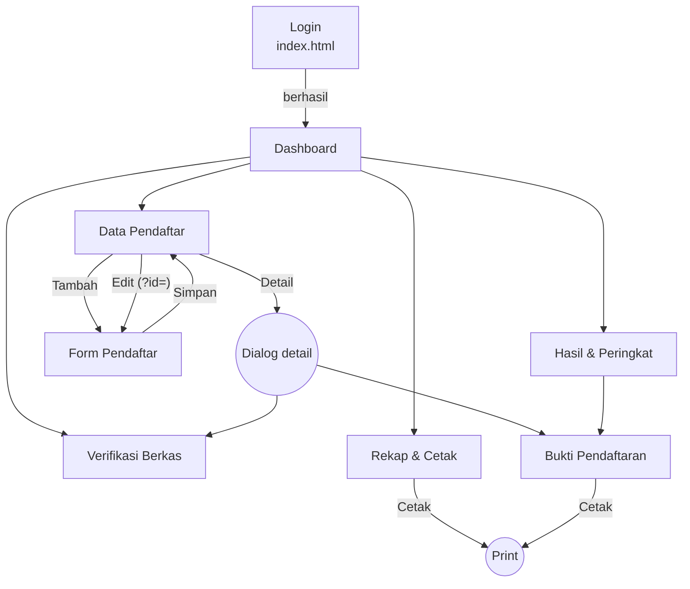

---

## 4. User Flow

### 4.1 Rutinitas harian panitia

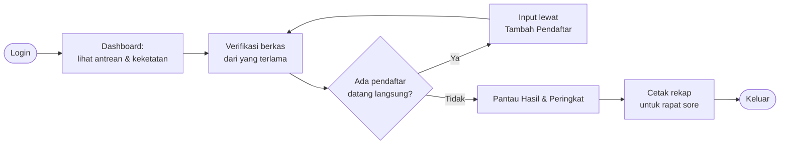

### 4.2 Verifikasi berkas

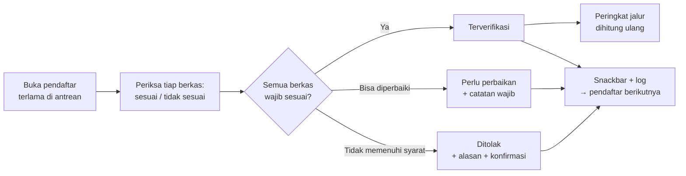

### 4.3 Input pendaftar offline (form 4 langkah)

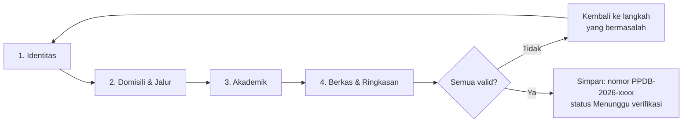

### 4.4 Siklus status pendaftar

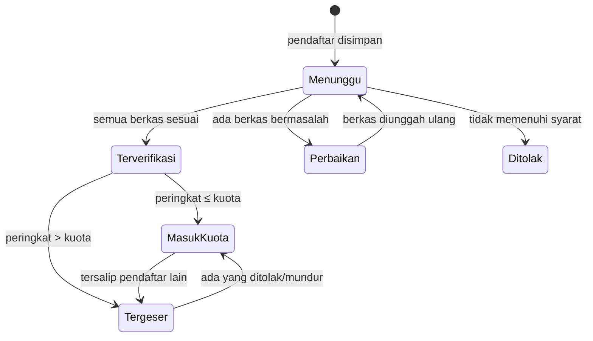

- **Status verifikasi** (Menunggu, Perbaikan, Terverifikasi, Ditolak) diubah **manual** oleh panitia.
- **Status seleksi** (Masuk kuota, Tergeser) **dihitung otomatis** dari peringkat. Panitia tidak "menerima" siswa satu per satu, sama seperti PPDB sungguhan.

---

## 5. Rancangan Data (ERD)

### 5.1 Diagram relasi

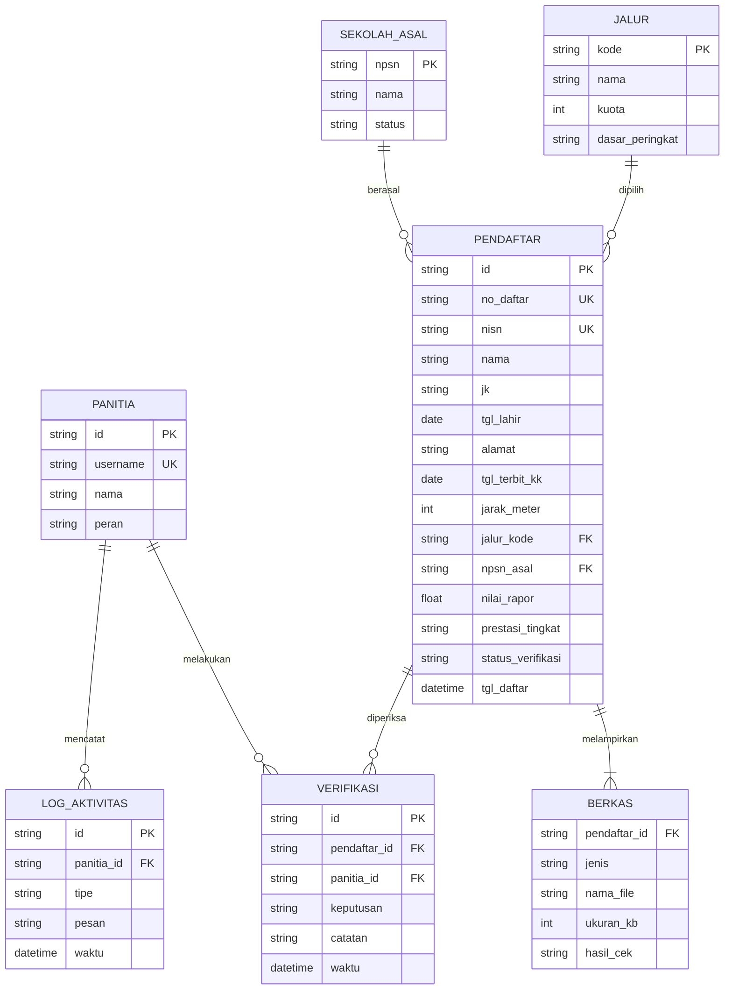

### 5.2 Kamus data ringkas
| Entitas | Fungsi | Penyimpanan |
|---|---|---|
| `PENDAFTAR` | Data calon siswa & status verifikasi | `localStorage` |
| `BERKAS` | Berkas per pendaftar (KK, akta, rapor, KIP, surat tugas, sertifikat) + hasil cek | `localStorage` (disimpan di dalam data pendaftar) |
| `VERIFIKASI` | Riwayat keputusan panitia beserta catatan | `localStorage` |
| `LOG_AKTIVITAS` | Jejak setiap perubahan data (maks. 100 entri) | `localStorage` |
| `JALUR` | 4 jalur, kuota, dasar peringkat | Konstanta JavaScript |
| `SEKOLAH_ASAL` | Daftar SMP/MTs asal | Konstanta JavaScript |
| `PANITIA` | Akun simulasi (`panitia` / `ppdb2026`) | Konstanta JavaScript |

| Nilai kode | Arti |
|---|---|
| `status_verifikasi` | `menunggu` · `perbaikan` · `terverifikasi` · `ditolak` |
| `jenis` berkas | `kk` · `akta` · `rapor` · `kip` · `surat_tugas` · `sertifikat` |
| `hasil_cek` | `belum` · `sesuai` · `tidak_sesuai` |
| `prestasi_tingkat` | `kota` (+2) · `provinsi` (+3) · `nasional` (+5) · kosong |

### 5.3 Jalur, kuota, dan jadwal
| Jalur | Kuota | Porsi | Dasar peringkat | Berkas tambahan |
|---|---|---|---|---|
| Zonasi | 216 | 50% | Jarak terdekat | – (KK wajib terbit ≥ 1 tahun) |
| Afirmasi | 65 | 15% | Jarak terdekat | Kartu KIP/PKH/KKS |
| Perpindahan Tugas Orang Tua | 21 | 5% | Jarak terdekat | Surat penugasan orang tua |
| Prestasi | 130 | 30% | Skor tertinggi (nilai rapor + bonus prestasi) | Sertifikat (jika ada) |
| **Total** | **432** | | | Semua jalur: KK, akta, rapor |

Jika jarak/skor sama, urutan ditentukan oleh usia yang lebih tua, lalu waktu daftar yang lebih awal.

| Tahap | Tanggal (simulasi) |
|---|---|
| Pendaftaran & unggah berkas | 8 – 19 Juni 2026 |
| Verifikasi berkas | 8 – 22 Juni 2026 |
| Pengumuman hasil | 26 Juni 2026 |
| Daftar ulang | 29 Juni – 1 Juli 2026 |

"Hari ini" dalam simulasi adalah **Kamis, 18 Juni 2026**, supaya demo selalu menampilkan kondisi di tengah masa pendaftaran.

---

## 6. Wireframe Halaman

Wireframe low-fidelity ini menunjukkan **susunan dan prioritas**, bukan ukuran akhir. Keterangan simbol:
- `(( … ))` = tombol *filled* (aksi utama)
- `( … )` = tombol lain
- `[ … ]` = input atau chip
- `###` = angka yang dihitung dari data

### 6.1 Kerangka dasar (dipakai semua halaman admin)

**Desktop (≥ 1200px): navigation drawer permanen**
```
┌────────────────┬─────────────────────────────────────────────────────┐
│ [logo] PPDB    │ =  Dashboard          [Pendaftaran · hari 9/12] (RK)│
│ SMAN 1 HB      │    PPDB Online / Dashboard                          │
│                ├─────────────────────────────────────────────────────┤
│ > Dashboard    │ Judul halaman                     ( aksi ) ((UTAMA))│
│                │ Keterangan singkat halaman                          │
│ PENDAFTARAN    │                                                     │
│   Data         │ ┌─────────────────────────────────────────────────┐ │
│   Tambah       │ │                                                 │ │
│   Verifikasi ##│ │          Area konten (grid 12 kolom)            │ │
│                │ │                                                 │ │
│ SELEKSI        │ └─────────────────────────────────────────────────┘ │
│   Hasil        │                                                     │
│                ├─────────────────────────────────────────────────────┤
│ LAPORAN        │ Data simulasi · SMAN 1 Harapan Bangsa (fiktif)      │
│   Rekap        │                                                     │
│ ────────────── │                                                     │
│   Keluar       │                                                     │
└────────────────┴─────────────────────────────────────────────────────┘
```

**Tablet (600–1199px): rail ikon · Mobile (< 600px): drawer modal**
```
┌────┬──────────────────────────────┐   ┌──────────────────────────┐
│ =  │ Dashboard            (RK)    │   │ =  Dashboard        (RK) │
├────┼──────────────────────────────┤   ├──────────────────────────┤
│ [] │ Judul         ((UTAMA))      │   │ Judul                    │
│ [] │                              │   │ ((UTAMA))                │
│ [] │ ┌──────────┐ ┌──────────┐    │   │ ┌──────────────────────┐ │
│ [] │ │ kartu    │ │ kartu    │    │   │ │ kartu (1 kolom)      │ │
│ [] │ └──────────┘ └──────────┘    │   │ └──────────────────────┘ │
│ [] │                              │   │ ┌──────────────────────┐ │
│    │                              │   │ │ tabel → daftar kartu │ │
└────┴──────────────────────────────┘   │ └──────────────────────┘ │
                                        └──────────────────────────┘
```

### 6.2 P-01 · Login (`index.html`)
```
┌──────────────────────────────────┬───────────────────────────────────┐
│ PPDB Online                      │ Masuk Panitia                     │
│ SMA Negeri 1 Harapan Bangsa      │                                   │
│ Tahun Ajaran 2026/2027           │ Username                          │
│                                  │ [                               ] │
│ Jadwal PPDB                      │ Kata sandi                        │
│ > 8–19 Jun   Pendaftaran (aktif) │ [                           (o) ] │
│   8–22 Jun   Verifikasi berkas   │ [x] Ingat saya                    │
│   26 Jun     Pengumuman          │                                   │
│   29 Jun–1 Jul  Daftar ulang     │ ((            Masuk            )) │
│                                  │                                   │
│                                  │ Akun demo: panitia / ppdb2026     │
│ Data simulasi                    │                                   │
└──────────────────────────────────┴───────────────────────────────────┘
```
Di mobile, panel kiri diringkas menjadi satu baris di atas form. **Tidak ada:** pilihan peran, loket, CAPTCHA, status server.

### 6.3 P-02 · Dashboard
```
┌──────────────────────────────────────────────────────────────────────┐
│ Ringkasan  [Kamis, 18 Jun 2026]          ((Mulai verifikasi (###)))  │
├─────────────────┬─────────────────┬─────────────────┬────────────────┤
│ Total pendaftar │ Menunggu        │ Perlu perbaikan │ Terverifikasi  │
│ ### +## hari ini│ ###             │ ###             │ ###            │
├─────────────────┴─────────────────┴──┬──────────────┴────────────────┤
│ Pendaftar per hari (8–18 Jun)        │ Antrean verifikasi (terlama)  │
│   ▅ █ ▇ ▆ ▅ ▄ ▄ ▃ ▃ ▂ ▂              │ 1. Nama · Zonasi · 3 hari     │
│                                      │ 2. Nama · Prestasi · 3 hari   │
│                                      │ ( Lihat semua )               │
├──────────────────────────────────────┼───────────────────────────────┤
│ Keterisian & keketatan per jalur     │ Jadwal PPDB                   │
│ Jalur    Kuota Verif Ketat  Batas    │ > Pendaftaran   8–19 Jun      │
│ Zonasi    216  ###   #,#x   ### m    │   Verifikasi    8–22 Jun      │
│ Prestasi  130  ###   #,#x   ##,##    │   Pengumuman    26 Jun        │
│ ...                                  │   Daftar ulang  29 Jun–1 Jul  │
└──────────────────────────────────────┴───────────────────────────────┘
```

### 6.4 P-03 · Data Pendaftar
```
┌──────────────────────────────────────────────────────────────────────┐
│ Data Pendaftar                    ( Ekspor CSV ) ((Tambah pendaftar))│
├──────────────────────────────────────────────────────────────────────┤
│ Semua ### | Menunggu ### | Perbaikan ### | Terverifikasi ### | Tolak │
├──────────────────────────────────────────────────────────────────────┤
│ [Cari nama / NISN / no. daftar]  [Jalur v]  [Sekolah asal v]         │
│ Filter aktif: [Zonasi x] [SMP Negeri 1 x]  Hapus filter              │
├───────────────┬──────────────────┬──────────┬────────┬──────┬────────┤
│ No. daftar  ^ │ Nama / NISN      │ Asal     │ Jalur  │ Jarak│ Status │
├───────────────┼──────────────────┼──────────┼────────┼──────┼────────┤
│ PPDB-2026-### │ Nama Siswa       │ SMP ...  │[Zonasi]│ ### m│[Tunggu]│
│ 18 Jun 09:12  │ 00########       │          │        │      │        │
├───────────────┴──────────────────┴──────────┴────────┴──────┴────────┤
│ Menampilkan 1–20 dari ###                      <  1  2  3 ... ##  >  │
└──────────────────────────────────────────────────────────────────────┘
```
Klik baris untuk membuka **dialog detail** (tautan ke Verifikasi & Bukti). Aksi per baris: Edit, Hapus (dialog konfirmasi, lalu snackbar "Urungkan").

### 6.5 P-04 · Form Tambah/Edit Pendaftar
```
┌──────────────────────────────────────────────────────────────────────┐
│ Tambah Pendaftar                                                     │
│ (1) Identitas ── (2) Domisili & Jalur ── (3) Akademik ── (4) Berkas  │
├──────────────────────────────────────────────────────────────────────┤
│ Langkah 2 · Domisili & Jalur                                         │
│ Alamat               [                                             ] │
│ Kelurahan [          ]   Kecamatan [          ]                      │
│ Tgl terbit KK [dd/mm/yyyy]   Jarak ke sekolah [      ] meter         │
│                                                                      │
│ Pilih jalur                                                          │
│ ┌──────────────┐ ┌──────────────┐ ┌──────────────┐ ┌──────────────┐  │
│ │(o) Zonasi    │ │( ) Afirmasi  │ │( ) Perpindah.│ │( ) Prestasi  │  │
│ │ Kuota 216    │ │ Kuota 65     │ │ Kuota 21     │ │ Kuota 130    │  │
│ │ KK >= 1 thn  │ │ + Kartu KIP  │ │ + Surat tugas│ │ Skor teratas │  │
│ └──────────────┘ └──────────────┘ └──────────────┘ └──────────────┘  │
│ ! KK terbit < 1 tahun: tidak memenuhi syarat jalur zonasi            │
├──────────────────────────────────────────────────────────────────────┤
│ ( Kembali )                                            ((Lanjut))    │
└──────────────────────────────────────────────────────────────────────┘
```
Langkah 4 menampilkan **ringkasan seluruh isian** dan tombol **Simpan**. Berkas yang wajib diunggah berubah mengikuti jalur yang dipilih.

### 6.6 P-05 · Verifikasi Berkas
```
┌──────────────────┬─────────────────────────────┬─────────────────────┐
│ Antrean (###)    │ [KK] [Akta] [Rapor] [KIP]   │ Data isian          │
│ [Cari]           │                             │ Nama   : ...        │
│ > Nama · 3 hari  │  ┌───────────────────────┐  │ NISN   : ...        │
│   Nama · 3 hari  │  │ KK_nama.pdf · 412 KB  │  │ Jalur  : Afirmasi   │
│   Nama · 2 hari  │  │                       │  │ Jarak  : ### m      │
│   ...            │  │ Pratinjau tidak       │  ├─────────────────────┤
│                  │  │ tersedia di versi     │  │ Cek berkas          │
│                  │  │ simulasi              │  │ KK    (o)Sesuai ( ) │
│                  │  └───────────────────────┘  │ Akta  (o)Sesuai ( ) │
│                  │                             │ Catatan [         ] │
│                  │                             │ ((Terverifikasi))   │
│                  │                             │ ( Perlu perbaikan ) │
│                  │                             │ ( Tolak )           │
└──────────────────┴─────────────────────────────┴─────────────────────┘
```
Tombol **Terverifikasi** baru aktif jika semua berkas wajib bertanda "sesuai". **Perbaikan** dan **Tolak** wajib disertai catatan, dan Tolak meminta konfirmasi.

### 6.7 P-06 · Hasil & Peringkat
```
┌──────────────────────────────────────────────────────────────────────┐
│ Hasil & Peringkat · sementara                          ( Ekspor CSV )│
│ [Zonasi 216] [Afirmasi 65] [Perpindahan 21] [Prestasi 130]           │
├─────────────────┬─────────────────┬─────────────────┬────────────────┤
│ Kuota 216       │ Terverif. ###   │ Keketatan #,#x  │ Batas ### m    │
├─────────────────┴─────────────────┴─────────────────┴────────────────┤
│ [Cari nama]   [x] Hanya sekitar garis batas                          │
│ Rank  Nama               Asal sekolah     Jarak    Status            │
│ 214   Nama Siswa         SMP ...          ### m    [Masuk kuota]     │
│ 215   Nama Siswa         SMP ...          ### m    [Masuk kuota]     │
│ 216   Nama Siswa         SMP ...          ### m    [Masuk kuota]     │
│ ════════ Garis batas kuota (216) · jarak terjauh ### m ════════════  │
│ 217   Nama Siswa         SMP ...          ### m    [Tergeser]        │
│ 218   Nama Siswa         SMP ...          ### m    [Tergeser]        │
├──────────────────────────────────────────────────────────────────────┤
│ Dasar peringkat: jarak terdekat → usia lebih tua → waktu daftar      │
└──────────────────────────────────────────────────────────────────────┘
```

### 6.8 P-07 · Rekap & Cetak
```
┌──────────────────────────────────────────────────────────────────────┐
│ Rekap & Cetak                          ( Ekspor CSV ) ((Cetak rekap))│
│ Dari [08/06/2026]  Sampai [18/06/2026]  [Semua jalur v]              │
├──────────────────────────────────────────────────────────────────────┤
│ Rekap per jalur                                                      │
│ Jalur     Kuota Daftar Tunggu Perbaikan Verif Tolak Ketat            │
│ Zonasi     216   ###    ###     ###      ###   ###  #,#x             │
│ ...                                                                  │
│ Total      432   ###    ###     ###      ###   ###                   │
├──────────────────────────────────┬───────────────────────────────────┤
│ 10 asal sekolah terbanyak        │ Pendaftar per hari                │
├──────────────────────────────────┴───────────────────────────────────┤
│ Log aktivitas (terbaru)                                              │
│ 18 Jun 10:02  Terverifikasi: Nama (PPDB-2026-###)                    │
└──────────────────────────────────────────────────────────────────────┘
```
Saat dicetak, navigasi disembunyikan dan muncul **kop sekolah fiktif tanpa lambang** serta kolom tanda tangan kosong.

### 6.9 P-08 · Bukti Pendaftaran (cetak A4)
```
┌──────────────────────────────────────────────────────────────────────┐
│ SMA NEGERI 1 HARAPAN BANGSA (fiktif) · Panitia PPDB 2026/2027        │
│ ──────────────────────────────────────────────────────────────────── │
│                     BUKTI PENDAFTARAN PPDB                           │
│                       No. PPDB-2026-####                             │
│ Nama          : ...                  Jalur        : Zonasi           │
│ NISN          : ...                  Jarak        : ### m            │
│ Asal sekolah  : ...                  Status       : Menunggu verif.  │
│                                                                      │
│ Berkas: KK (sesuai) · Akta (sesuai) · Rapor (belum dicek)            │
│ Jadwal: pengumuman 26 Jun 2026 · daftar ulang 29 Jun – 1 Jul 2026    │
│                                                                      │
│ Pendaftar / Orang tua                         Petugas panitia        │
│                                                                      │
│ (....................)                     (....................)    │
│ Dokumen simulasi, bukan dokumen resmi.                               │
└──────────────────────────────────────────────────────────────────────┘
```
**Tidak ada:** lambang pemerintah, stempel, tanda tangan palsu, QR code, barcode, atau hash.

---

## 7. Design System

Sumber awal: `DESIGN.md` dari Google Stitch (varian PPDB), lalu disesuaikan ke kaidah Material Design 3. Nilai ini menjadi acuan **`assets/css/tokens.css`** dan **`docs/styleguide.html`** (Milestone 2).

### 7.1 Palet warna
| Peran M3 | HEX | Penggunaan |
|---|---|---|
| `primary` | `#0F3F7A` | Tombol utama, menu aktif, judul penting |
| `on-primary` | `#FFFFFF` | Teks di atas primary |
| `primary-container` | `#D6E3FF` | Latar tombol tonal, menu aktif |
| `on-primary-container` | `#001B3E` | Teks di atas primary-container |
| `secondary` | `#0D9488` | Aksen jalur & kuota (hemat) |
| `secondary-container` | `#CCFBF1` | Latar chip jalur |
| `surface` | `#F8FAFC` | Kanvas halaman |
| `surface-container-lowest` | `#FFFFFF` | Kartu, tabel, dialog |
| `surface-container` | `#F1F5F9` | Header tabel, area input |
| `on-surface` | `#0F172A` | Teks utama |
| `on-surface-variant` | `#475569` | Teks sekunder |
| `outline` | `#CBD5E1` | Garis input |
| `outline-variant` | `#E2E8F0` | Garis pemisah, tepi kartu |

**Warna status** (hanya untuk status):
| Status | Teks | Latar | Garis |
|---|---|---|---|
| Menunggu verifikasi (info) | `#0369A1` | `#F0F9FF` | `#BAE6FD` |
| Perlu perbaikan (warning) | `#B45309` | `#FFFBEB` | `#FDE68A` |
| Terverifikasi / Masuk kuota (success) | `#15803D` | `#F0FDF4` | `#BBF7D0` |
| Ditolak / aksi hapus (danger) | `#B91C1C` | `#FEF2F2` | `#FECACA` |
| Tergeser (netral) | `#475569` | `#F1F5F9` | `#CBD5E1` |

**Grafik per jalur:** Zonasi `#0F3F7A` · Prestasi `#0D9488` · Afirmasi `#0284C7` · Perpindahan `#B45309`.

### 7.2 Tipografi: Plus Jakarta Sans
| Gaya | Ukuran / tinggi baris / bobot | Dipakai untuk |
|---|---|---|
| Headline Large | 24 / 32 / 700 | Judul halaman |
| Headline Small | 18 / 26 / 600 | Judul kartu & bagian |
| Title Medium | 16 / 24 / 600 | Judul dialog |
| Display Small | 28 / 36 / 700 | Angka KPI |
| Body Medium | 14 / 20 / 400 | Teks dasar aplikasi |
| Body Small | 12 / 16 / 400 | Keterangan & hint |
| Label Large | 14 / 20 / 600 | Tombol & tab |
| Label Medium | 12 / 16 / 600 | Header tabel & chip |

Angka (NISN, jarak, skor, tanggal) memakai **tabular numbers** agar kolom tabel lurus.

### 7.3 Bentuk, elevasi, jarak
| Aspek | Nilai |
|---|---|
| Radius | Tombol: pil · Chip, badge, input: 8px · Kartu: 12px · Dialog: 16px |
| Elevasi | Kartu: garis `outline-variant` + bayangan tipis · Menu: bayangan sedang · Dialog: bayangan + scrim 50% |
| State layer | Hover 8% · Fokus 10% + cincin 2px `#0284C7` · Ditekan 10% |
| Skala jarak | 4 · 8 · 12 · 16 · 24 · 32 · 48 px |
| Breakpoint | Compact < 600 · Medium 600–839 · Expanded 840–1199 · Large ≥ 1200 |
| Navigasi | Drawer 280px · Rail 80px · Top app bar 64px |
| Ikon | Material Symbols Outlined, 20/24px (terisi saat menu aktif) |

### 7.4 Komponen reusable
| Komponen | Varian & state | Dipakai di |
|---|---|---|
| **Button** | filled · tonal · outlined · text · danger · icon · (hover, fokus, ditekan, disabled) | Semua |
| **Text field** | outlined · dengan ikon · hint · error · disabled | Login, Form, filter |
| **Select, checkbox, radio, radio-card** | normal · terpilih · error | Form, Verifikasi |
| **Chip** | filter · filter aktif (bisa dihapus) · jalur | Data Pendaftar, Hasil |
| **Badge status** | menunggu · perbaikan · terverifikasi · ditolak · masuk kuota · tergeser | Tabel, detail |
| **Card** | standar · KPI | Dashboard, Laporan |
| **Data table** | sortable · baris garis batas · mode kartu (mobile) | Data Pendaftar, Hasil, Laporan |
| **Tabs, pagination, stepper, progress bar** | aktif · nonaktif · selesai | Data Pendaftar, Form, Dashboard |
| **Dialog** | konfirmasi · detail | Hapus, Tolak, detail pendaftar |
| **Snackbar** | info · dengan aksi "Urungkan" | Setelah simpan, hapus, verifikasi |
| **Navigation drawer / rail, top app bar** | permanen · rail · modal | Kerangka dasar |
| **Empty state, skeleton** | – | Tabel kosong, grafik dimuat |

---

## 8. Proses Desain

### 8.1 Google Stitch
Wireframe awal dibuat dengan **Google Stitch** (7 layar + logo). Hasilnya dijadikan **referensi**, lalu ditinjau secara kritis sebelum diimplementasikan.

| Login | Dashboard |
|---|---|
| 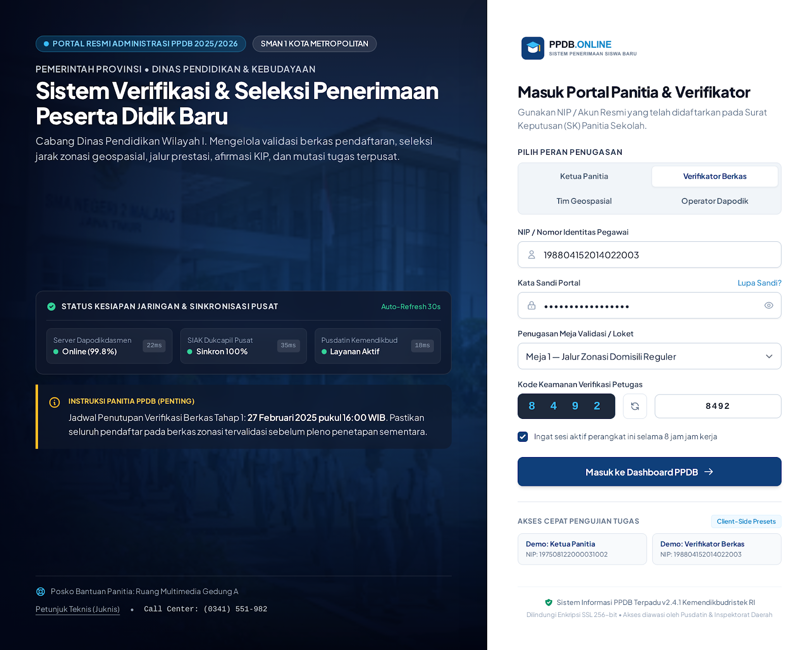 | 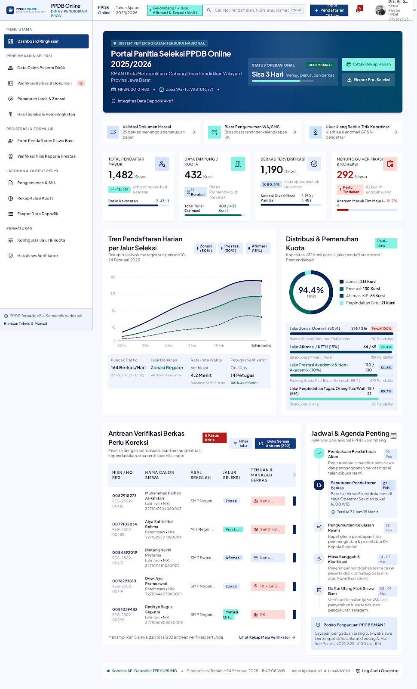 |
| **Data Pendaftar** | **Form Pendaftaran** |
| 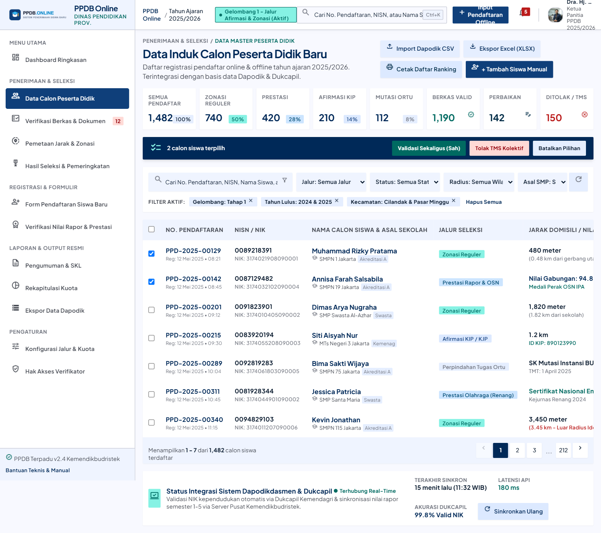 | 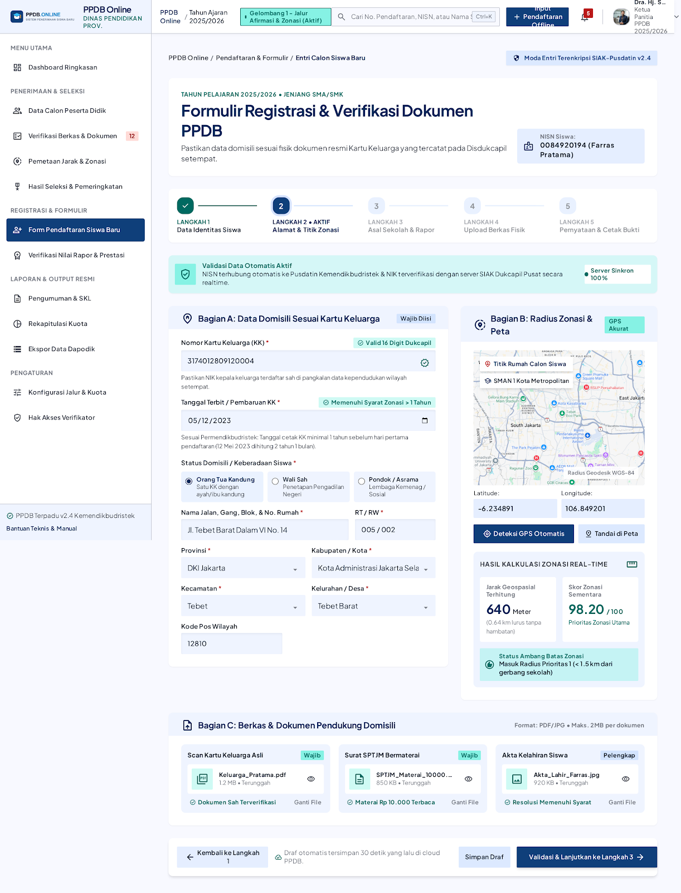 |
| **Verifikasi Berkas** | **Hasil Seleksi** |
| 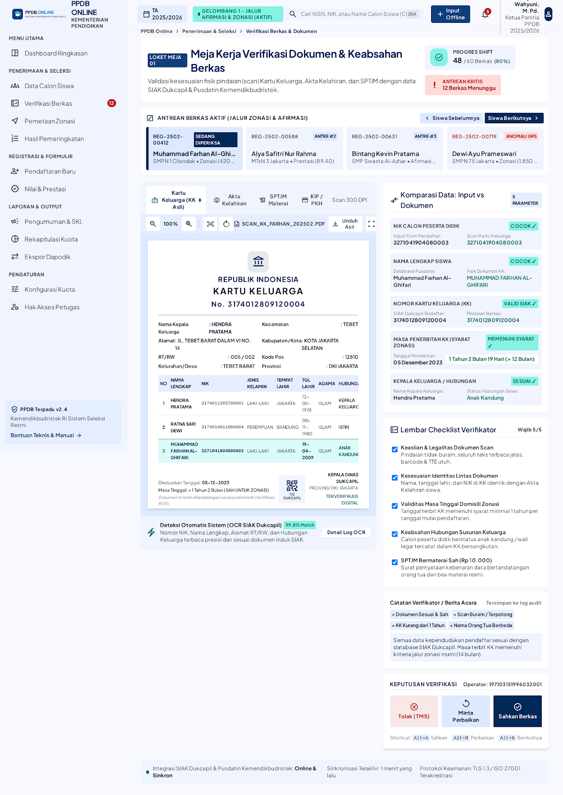 | 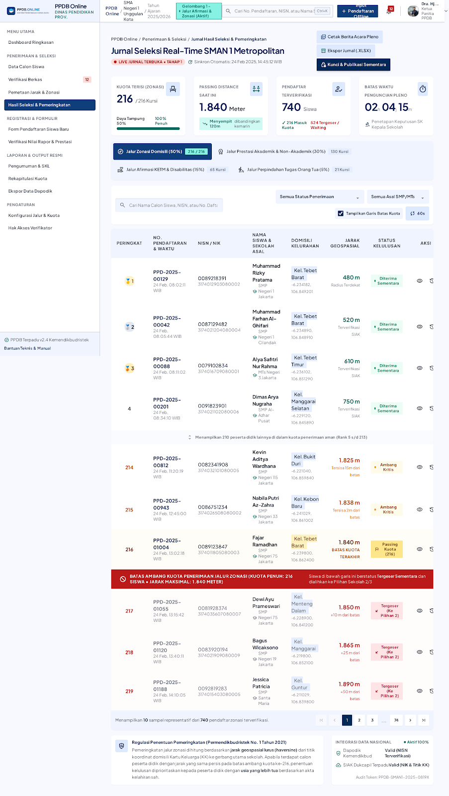 |
| **Bukti Pendaftaran** | **Logo** |
| 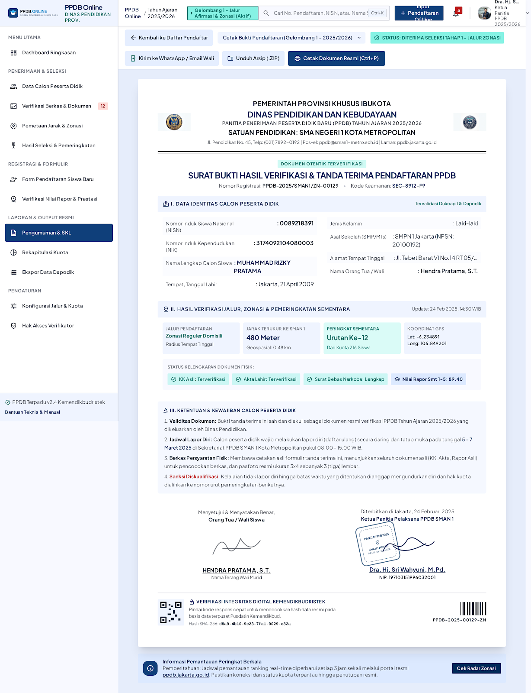 |  |

**Hasil peninjauan:**
| Elemen Stitch | Keputusan | Alasan / perbaikan |
|---|---|---|
| Sidebar + top bar + breadcrumb | ✅ Dipertahankan | Top bar dirampingkan menjadi 4 elemen. Nama pengguna tidak terpotong |
| Tabel peringkat dengan garis batas kuota | ✅ Dipertahankan | Ide paling berguna: panitia langsung melihat siapa yang tergeser |
| Form bertahap (stepper) | ✅ Dipertahankan | Diringkas dari 5 menjadi 4 langkah |
| Kartu KPI | 🔧 Diperbaiki | Maksimal 4 kartu, masing-masing 1 angka + 1 keterangan |
| Verifikasi dua panel | 🔧 Diperbaiki | Pratinjau jujur ("tidak tersedia di versi simulasi") + checklist per berkas |
| Bukti pendaftaran | 🔧 Diperbaiki | Tanpa lambang, stempel, tanda tangan, QR, barcode, hash |
| Menu 11 item | 🔧 Diperbaiki | 7 item, semuanya berfungsi |
| Banner "Portal Seleksi Terintegrasi Nasional" | ❌ Dibuang | Bahasa promosi, bukan informasi kerja |
| Status Dapodik/Dukcapil, latensi API, OCR 99,8% | ❌ Dibuang | Metrik palsu: tidak ada integrasinya |
| Peta GPS & deteksi lokasi | ❌ Dibuang | Butuh layanan peta. Jarak diinput dalam meter |
| Pilihan peran, meja loket, CAPTCHA di login | ❌ Dibuang | Menambah langkah tanpa manfaat |
| Aksi massal "Validasi Sekaligus" | ❌ Dibuang | Memverifikasi tanpa melihat berkas tidak realistis |
| Nama sekolah & instansi berbeda di tiap layar | ❌ Dibuang | Diganti satu identitas fiktif yang konsisten |

### 8.2 Dari desain ke kode
Proyek ini **tidak memakai Figma**. Desain berjalan dalam tiga lapis:
1. **Google Stitch:** eksplorasi tata letak awal (§8.1).
2. **Dokumen ini:** wireframe low-fidelity (§6) dan design system (§7) hasil peninjauan Stitch.
3. **`docs/styleguide.html`** (Milestone 2): semua token dan komponen §7 diwujudkan langsung dalam HTML/CSS sebagai acuan visual final.

**Tautan publik proyek Google Stitch:** _menyusul (T1-17)_
