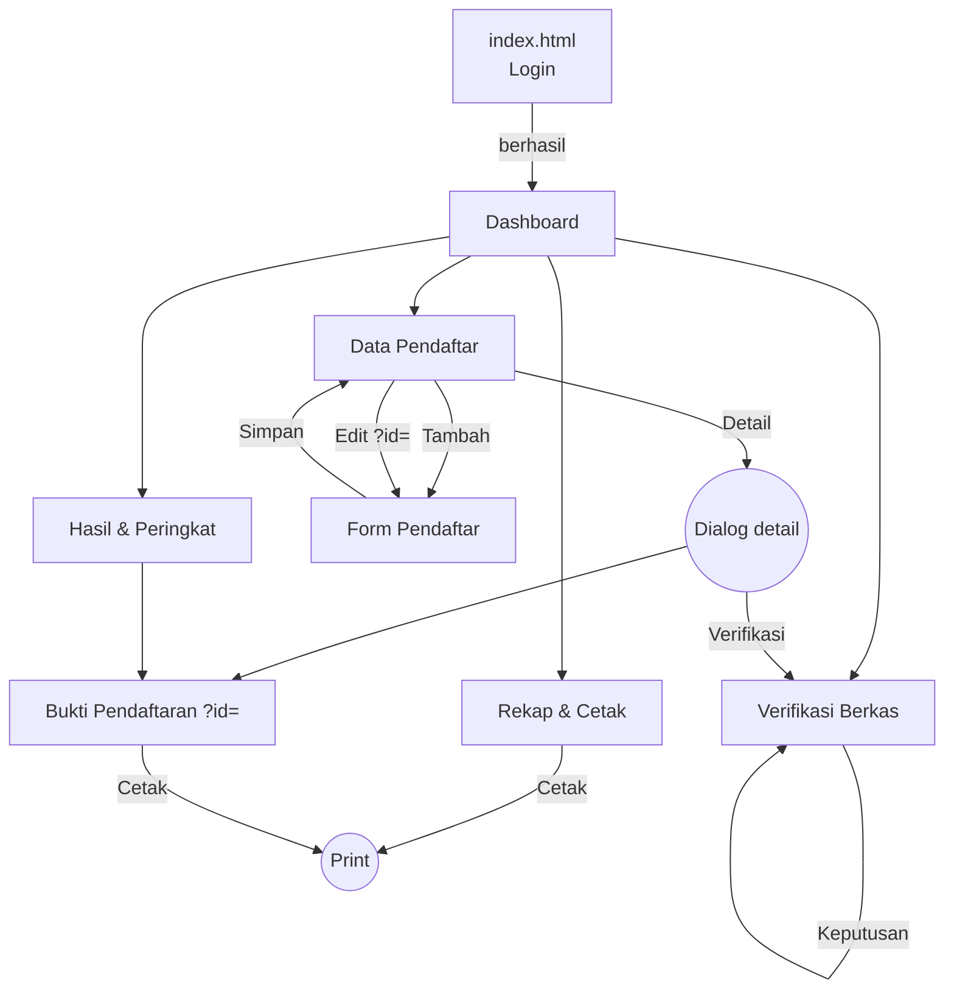
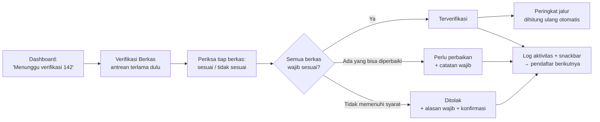
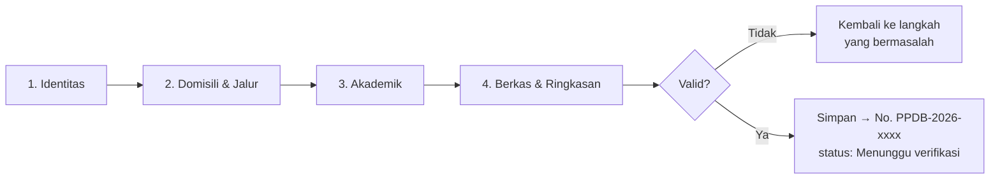
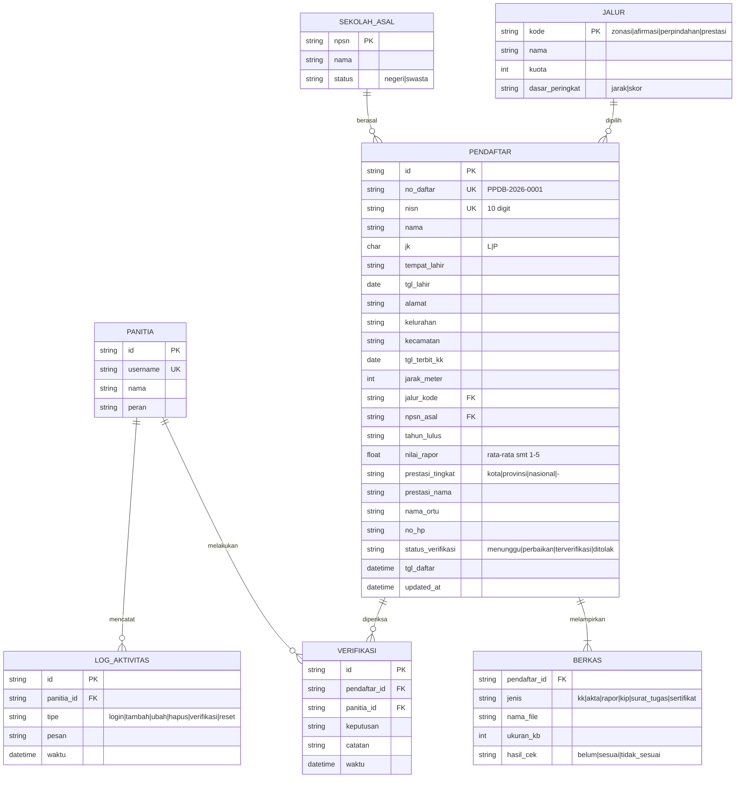
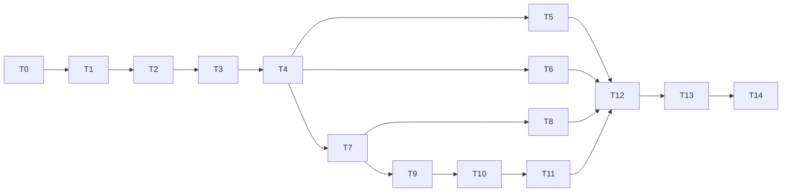
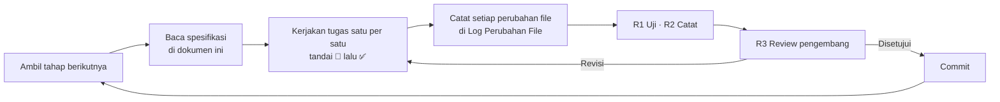

# 📘 Perencanaan Pengembangan — Admin Panel PPDB Online

> **Dokumen induk (master plan).** Dokumen ini menjelaskan **apa** yang dibangun, **mengapa**, dan **aturannya**.
> Progres pekerjaan dilacak di **[checklist_work.md](checklist_work.md)**. Keduanya terhubung lewat ID:
> - Tahap `T0`–`T14` (§11) = heading tahap di checklist.
> - Tugas di checklist (mis. `T7-04`) menunjuk balik ke ID di dokumen ini: kebutuhan `FR-xx`/`NFR-xx`, aturan `BR-xx`, prinsip `AS-xx`, halaman `P-xx`, keputusan `D-xx`, kasus uji `TC-xx`.

| Atribut | Keterangan |
|---|---|
| Nama proyek | Admin Panel PPDB Online — SMA Negeri 1 Harapan Bangsa (fiktif) |
| Mata kuliah | Pemrograman Web 2 (Client-Side Programming) — Tugas 1 (Project-Based Learning) |
| Pengembang | Nurdin (akun GitHub `nurdinrhk-design`) |
| Versi dokumen | **0.2.6** |
| Tanggal | 23 September 2026 |
| Dokumen terkait | [checklist_work.md](checklist_work.md) · `docs/perancangan.md` (deliverable M1, dibuat di T1) · [referensi Stitch](img/referensi-stitch/) |
| Status | ✅ Disetujui pengembang (23 Sep 2026). Tahap aktif: T1 |

---

## Daftar Isi

1. [Ringkasan Proyek](#1-ringkasan-proyek)
2. [Ketentuan Tugas & Pemetaan Penilaian](#2-ketentuan-tugas--pemetaan-penilaian)
3. [Keputusan & Asumsi](#3-keputusan--asumsi)
4. [Prinsip Desain Anti-"AI Slop"](#4-prinsip-desain-anti-ai-slop)
5. [Aktor & Kebutuhan](#5-aktor--kebutuhan)
6. [Arsitektur Informasi](#6-arsitektur-informasi)
7. [Model Data & Aturan Bisnis](#7-model-data--aturan-bisnis)
8. [Spesifikasi Halaman](#8-spesifikasi-halaman)
9. [Design System (Material Design 3)](#9-design-system-material-design-3)
10. [Arsitektur Teknis](#10-arsitektur-teknis)
11. [Tahapan Pengembangan](#11-tahapan-pengembangan)
12. [Strategi Pengujian](#12-strategi-pengujian)
13. [Risiko & Mitigasi](#13-risiko--mitigasi)
14. [Definition of Done](#14-definition-of-done)
15. [Alur Kerja & Aturan Pencatatan](#15-alur-kerja--aturan-pencatatan)
16. [Riwayat Perubahan](#16-riwayat-perubahan)

---

## 1. Ringkasan Proyek

### 1.1 Latar belakang
Setiap bulan Juni, panitia PPDB sekolah menerima ratusan pendaftar untuk kuota yang terbatas. Pekerjaan hariannya adalah:
- memeriksa berkas (KK, akta, rapor),
- memantau keterisian kuota per jalur,
- melihat siapa yang masuk dan siapa yang tergeser dari peringkat,
- mencetak rekap untuk rapat panitia.

Proyek ini membangun **Admin Panel (Back-Office)** untuk pekerjaan tersebut. Fokusnya **sisi klien**: arsitektur informasi, navigasi, UI, dan UX, **tanpa back-end** (mock data di browser).

### 1.2 Tujuan
| ID | Tujuan |
|---|---|
| G-01 | Antarmuka admin yang **responsif** di mobile, tablet, dan desktop. |
| G-02 | Tema **Material Design 3** yang diterapkan konsisten dan bisa dijelaskan saat presentasi. |
| G-03 | Minimal 4 halaman wajib (Dashboard, Data Master, Form, Laporan/Detail), ditambah halaman khas PPDB (Verifikasi, Hasil Seleksi). |
| G-04 | Interaktivitas JavaScript yang **bermakna**: sidebar, dialog, validasi, grafik, dan manipulasi data yang memengaruhi seluruh halaman. |
| G-05 | Tampilan yang **realistis dan profesional**, bebas elemen "AI slop" (§4). |
| G-06 | Dokumentasi M1 lengkap, kode di GitHub, dan demo di Vercel. |

### 1.3 Ruang lingkup
**Termasuk:** login simulasi, dashboard, data pendaftar (CRUD), form input pendaftar offline (stepper), verifikasi berkas, hasil & peringkat per jalur, laporan rekap, bukti pendaftaran cetak, template layout, dokumentasi.

**Tidak termasuk (dengan alasan):**
| Fitur | Alasan dikeluarkan |
|---|---|
| Server, database, API | Tugas client-side. **Ditambahkan di Fase 2** setelah tugas dikumpulkan (D-21, T14) |
| Integrasi Dapodik/Dukcapil, OCR, sinkronisasi | Tidak bisa dibuat nyata tanpa back-end. Menampilkannya berarti memalsukan (AS-01) |
| Peta GPS & hitung jarak otomatis | Butuh layanan peta. Jarak diinput petugas dalam meter |
| Blast WhatsApp/SMS | Butuh gateway eksternal |
| Portal calon siswa | Topik tugas adalah admin panel |
| Multi-peran & hak akses | Satu peran (panitia) cukup untuk lingkup tugas |
| Unggah file sungguhan | Hanya nama, jenis, dan ukuran file yang divalidasi dan disimpan |

---

## 2. Ketentuan Tugas & Pemetaan Penilaian

### 2.1 Milestone resmi → tahap internal
| Milestone | Tenggat | Output wajib | Tahap |
|---|---|---|---|
| **M1**: Perencanaan & wireframe | Pekan ke-3 | `docs/perancangan.md` (menu, ERD Mermaid, link Stitch (pengganti Figma, D-20), screenshot Stitch) | T0, T1 |
| **M2**: Slicing & layouting | Pekan ke-5 | CSS hasil slicing + `layout.html` | T2, T3 |
| **M3**: Komponen & interaktivitas | Pekan ke-7 | Source code lengkap + deploy | T4 – T13 |

### 2.2 Kriteria penilaian → pekerjaan
| Komponen | Bobot | Dipenuhi oleh | Bukti saat presentasi |
|---|---|---|---|
| Milestone 1 (dokumentasi, Stitch, Figma) | 20% | T1 | `perancangan.md`, link Stitch, screenshot. Tanpa Figma (D-20): design system dibuktikan lewat §9 + `styleguide.html` |
| Kualitas HTML & CSS | 30% | T2, T3, T5–T11, T12 | Tag semantik, CSS modular bertoken, validator W3C, uji responsif |
| Interaktivitas JavaScript | 20% | T3–T11 | Drawer/rail, dialog, validasi stepper, Chart.js, verifikasi yang mengubah peringkat |
| Kesesuaian UI/UX topik | 20% | T6, T9, T10, T11 | Keketatan per jalur, antrean verifikasi FIFO, garis batas kuota |
| Presentasi | 10% | T13 | Naskah demo |

### 2.3 Struktur folder wajib (panduan tugas)
`docs/perancangan.md`, `assets/{css,js,img}/`, `pages/*.html`, dan `index.html` sebagai halaman login. Struktur lengkap proyek ada di §10.1.

---

## 3. Keputusan & Asumsi

Status: ✅ Disepakati · 🔄 Bisa ditinjau ulang

| ID | Keputusan | Pilihan | Status | Alasan |
|---|---|---|---|---|
| D-01 | Tema visual | **Material Design 3** (M3) | ✅ | Sesuai arah desain Stitch. Cocok untuk aplikasi kerja yang padat data |
| D-02 | Identitas | **SMA Negeri 1 Harapan Bangsa**, Kota Nusantara (fiktif). TA **2026/2027** | ✅ | Satu identitas konsisten. Tidak meniru sekolah/instansi nyata |
| D-03 | Penyimpanan data | **Fase 1 (tugas):** `localStorage` + data simulasi deterministik (seed tetap). **Fase 2:** Supabase (D-21) | ✅ | Sederhana, bekerja offline, hasil demo selalu sama |
| D-04 | CSS | **CSS3 murni, modular** (`main.css` meng-`@import` token, base, layout, komponen, halaman, print) | ✅ | Mudah dijelaskan. Kelas semantik, bukan utility soup |
| D-05 | JavaScript | Vanilla JS, pola IIFE + namespace global, tanpa build tool | ✅ | Bisa dibuka lewat `file://` dan di-deploy statis |
| D-06 | Grafik | Chart.js 4 (jsDelivr, versi dipatok) | ✅ | Sesuai panduan |
| D-07 | Font & ikon | Plus Jakarta Sans + Material Symbols Outlined | ✅ | Dari `DESIGN.md` Stitch. Ikon resmi keluarga Material |
| D-08 | Bahasa | UI dan komentar kode dalam Bahasa Indonesia | ✅ | |
| D-09 | Hosting | GitHub + Vercel (statis, tanpa build) | ✅ | |
| D-10 | Kode draf lama | Dihapus. Dibangun ulang per tahap | ✅ | Dihapus 23 Sep 2026 (T0-09) |
| D-11 | Istilah & regulasi | Istilah **PPDB** dengan 4 jalur: **Zonasi, Afirmasi, Perpindahan Tugas Orang Tua, Prestasi** | ✅ | Sesuai judul tugas. Sejak 2025 istilah resmi berganti menjadi SPMB, tetapi di luar lingkup tugas |
| D-12 | Waktu | **Tanggal simulasi tetap:** "hari ini" = **Kamis, 18 Juni 2026**. Jam memakai jam asli perangkat | ✅ | Demo konsisten dan realistis di tengah masa pendaftaran |
| D-13 | Sumber desain | Referensi Stitch dipakai sebagai **acuan, bukan disalin**. Boleh improvisasi | ✅ | Menghilangkan AI slop (§4) |
| D-14 | Status | Status **verifikasi** diubah manual oleh panitia. Status **seleksi** dihitung otomatis dari peringkat | ✅ | Seperti PPDB nyata: panitia tidak "menerima" siswa satu per satu |
| D-15 | Kuota | **432 kursi** (12 rombel × 36) | ✅ | Sesuai angka desain Stitch |
| D-16 | Alur kerja | Satu tahap per sesi. Berhenti untuk **review pengembang** di akhir tiap tahap | ✅ | Permintaan pengembang |
| D-17 | Kejujuran konten | Tanpa logo pemerintah, tanpa tanda tangan/stempel/QR palsu. Label "Data simulasi" | ✅ | Etika & AS-06 |
| D-18 | Keamanan repo publik | Commit memakai **email noreply GitHub** (diatur lokal per repo). `.gitignore` memblokir file rahasia & ekspor data. **Audit keamanan wajib sebelum setiap push** (§15.1) | ✅ | Repo `nurdinrhk-design/PROGRAMWEB_2` bersifat publik |
| D-19 | Hosting lanjutan | Setelah T14 (database sungguhan) selesai: **domain kustom** di Vercel (HTTPS otomatis) + **header keamanan** lewat `vercel.json` (CSP, `X-Frame-Options`, `Referrer-Policy`). Label "Data simulasi" tetap tampil selama tidak memakai data asli | 🔄 | Keinginan pengembang. Opsional, dikerjakan di T14-11…T14-13 |
| D-20 | Figma | **Tidak memakai Figma.** `perancangan.md` memuat link publik Google Stitch sebagai gantinya. Design system dibuktikan lewat `perancangan.md` §7 dan `docs/styleguide.html` | ✅ | Keputusan pengembang 23 Sep 2026. Fokus ke kualitas web akhir. Risiko: R-01 |
| D-21 | Database | **Dua fase.** Fase 1 (versi tugas): `localStorage` lewat **lapisan adapter** + ekspor/impor cadangan JSON. Versi ini ditandai rilis `v1.0-tugas`. Fase 2 (sebelum hosting ke domain): **Supabase** (PostgreSQL, Auth, RLS, Storage, region Singapura) dengan data simulasi | ✅ | Keputusan pengembang 23 Sep 2026. Adapter membuat migrasi cukup mengganti satu file. Data tetap simulasi (bukan data siswa asli) |

**Asumsi:**
- A-01: Satu peran pengguna: **Panitia PPDB** (akun demo `panitia` / `ppdb2026`).
- A-02: Setiap pendaftar memilih **satu jalur** di **satu sekolah**.
- A-03: Browser modern (Chrome, Edge, Firefox, Safari terbaru).
- A-04: Internet tersedia untuk CDN (font, ikon, Chart.js). Ada fallback yang jelas jika gagal.

---

## 4. Prinsip Desain Anti-"AI Slop"

"AI slop" di sini adalah elemen yang **tampak canggih tetapi tidak berguna, tidak jujur, atau tidak konsisten**. Setiap halaman wajib lolos **Uji Anti-Slop** (§4.3) sebelum tahapnya ditutup.

### 4.1 Prinsip
| ID | Prinsip | Artinya dalam praktik |
|---|---|---|
| AS-01 | **Tidak ada fitur atau metrik palsu** | Tidak ada "latensi API", "akurasi OCR", "server sinkron 100%", "enkripsi 256-bit" |
| AS-02 | **Setiap angka bisa ditelusuri** | Semua angka dihitung dari satu sumber data (`PPDB.store`). Tidak ada angka yang ditulis manual di HTML |
| AS-03 | **Setiap elemen menjawab pertanyaan panitia** | Jika tidak bisa disebutkan pertanyaan apa yang dijawab, elemen dibuang |
| AS-04 | **Satu aksi utama per halaman** | Hanya satu tombol *filled*. Aksi lain *tonal*, *outlined*, atau *text* |
| AS-05 | **Warna = makna** | Warna status hanya untuk status. Aksen tidak dipakai sebagai hiasan |
| AS-06 | **Jujur tentang simulasi** | Identitas fiktif, label "Data simulasi", tanpa dokumen resmi palsu |
| AS-07 | **Bahasa kerja, bukan bahasa promosi** | "Menunggu verifikasi: 142", bukan "Portal Seleksi Terintegrasi Nasional" |
| AS-08 | **Tidak ada teks penting yang terpotong** | Nama, nomor, dan tombol tidak boleh terpotong. Kolom tabel tidak meluber |
| AS-09 | **Kepadatan yang wajar** | Maksimal 4 KPI di satu baris. Badge maksimal 1 per sel. Tidak ada "banner hero" di aplikasi kerja |
| AS-10 | **Konsisten** | Satu nama sekolah, satu tahun ajaran, satu format tanggal (`18 Jun 2026`), satu format nomor (`PPDB-2026-0001`) |

### 4.2 Keputusan atas desain Stitch
| Elemen Stitch | Keputusan | Pengganti / perbaikan |
|---|---|---|
| Sidebar + topbar + breadcrumb | ✅ Dipertahankan | Topbar dirampingkan menjadi 4 elemen. Nama pengguna tidak terpotong |
| Kartu KPI | 🔧 Diperbaiki | Maksimal 4, masing-masing 1 angka + 1 keterangan. Sub-metrik dibuang |
| Tabel peringkat dengan garis batas kuota | ✅ Dipertahankan | Ide terbaik di desain. Dihitung otomatis (T10) |
| Form bertahap (stepper) | ✅ Dipertahankan | Dari 5 menjadi 4 langkah, validasi per langkah |
| Verifikasi dua panel | 🔧 Diperbaiki | Panel pratinjau jujur ("pratinjau tidak tersedia di versi simulasi") + checklist per berkas |
| Bukti pendaftaran cetak | 🔧 Diperbaiki | Tanpa lambang, stempel, tanda tangan palsu, QR, barcode, hash |
| Banner hero dashboard | ❌ Dibuang | AS-07, AS-09 |
| Status Dapodik/Dukcapil, latensi, OCR, "Server Sinkron" | ❌ Dibuang | AS-01 |
| Peta GPS, deteksi GPS | ❌ Dibuang | Jarak diinput manual dalam meter |
| Pilihan peran, meja loket, CAPTCHA di login | ❌ Dibuang | Login cukup username + password |
| Blast WA/SMS, "Import Dapodik CSV" | ❌ Dibuang | Tidak ada back-end |
| Aksi massal "Validasi Sekaligus" | ❌ Dibuang | Verifikasi tanpa melihat berkas tidak realistis |
| 11 menu sidebar (banyak tanpa halaman) | 🔧 Diperbaiki | 7 menu, semuanya berfungsi |
| Dua `DESIGN.md` (SIAKAD & PPDB) | 🔧 Diperbaiki | Hanya `sistem_informasi_ppdb_terpadu` yang dipakai, lalu disesuaikan ke M3 (§9) |
| Foto gedung bertuliskan nama sekolah nyata | ❌ Dibuang | Panel login memakai warna solid + info jadwal |

### 4.3 Uji Anti-Slop (dipakai di setiap tahap halaman)
Satu halaman lolos jika **semua** jawaban "ya":
1. Semua angka berasal dari data dan berubah jika data berubah? (AS-02)
2. Tidak ada klaim integrasi, keamanan, atau metrik teknis palsu? (AS-01)
3. Hanya satu tombol *filled*? (AS-04)
4. Warna status hanya dipakai untuk status? (AS-05)
5. Tidak ada teks penting yang terpotong di 360px dan 1440px? (AS-08)
6. Setiap kartu/panel bisa dijelaskan dengan satu kalimat "ini menjawab pertanyaan …"? (AS-03)
7. Identitas, tanggal, dan format nomor konsisten dengan halaman lain? (AS-10)

---

## 5. Aktor & Kebutuhan

### 5.1 Aktor & skenario
| Aktor | Skenario utama |
|---|---|
| **Panitia PPDB** (verifikator) | Membuka dashboard setiap pagi → mengerjakan antrean verifikasi dari yang paling lama menunggu → menginput pendaftar yang datang langsung ke sekolah → memantau peringkat & keketatan jalur → mencetak rekap untuk rapat sore |

### 5.2 Kebutuhan fungsional (FR)
| ID | Kebutuhan | Halaman | Tahap |
|---|---|---|---|
| FR-01 | Login & logout (simulasi) dengan pesan error yang jelas | P-01, semua | T4, T5 |
| FR-02 | Halaman admin tidak bisa dibuka tanpa login | Semua `pages/*` | T4 |
| FR-03 | Ringkasan kerja hari ini: total pendaftar, menunggu verifikasi, perlu perbaikan, terverifikasi | P-02 | T6 |
| FR-04 | Grafik pendaftar per hari selama masa pendaftaran | P-02 | T6 |
| FR-05 | Keterisian & keketatan per jalur, termasuk batas nilai/jarak sementara | P-02, P-06 | T6, T10 |
| FR-06 | Antrean verifikasi terlama & jadwal PPDB | P-02 | T6 |
| FR-07 | Tabel pendaftar: cari, filter (status, jalur, asal sekolah), urutkan, paginasi | P-03 | T7 |
| FR-08 | Detail pendaftar dalam dialog | P-03 | T7 |
| FR-09 | Hapus pendaftar dengan dialog konfirmasi | P-03 | T7 |
| FR-10 | Tambah pendaftar (input offline) lewat form bertahap tervalidasi | P-04 | T8 |
| FR-11 | Edit pendaftar | P-04 | T8 |
| FR-12 | Verifikasi berkas: checklist per dokumen, catatan, keputusan (terverifikasi / perlu perbaikan / ditolak) | P-05 | T9 |
| FR-13 | Peringkat otomatis per jalur dengan garis batas kuota | P-06 | T10 |
| FR-14 | Laporan rekap per jalur, per asal sekolah, per hari, dan log aktivitas, dengan filter | P-07 | T11 |
| FR-15 | Cetak laporan & bukti pendaftaran (tata letak khusus cetak) | P-07, P-08 | T11 |
| FR-16 | Ekspor CSV (data pendaftar, peringkat, rekap) | P-03, P-06, P-07 | T7, T10, T11 |
| FR-17 | Kembalikan data ke kondisi awal simulasi | P-03 | T7 |
| FR-18 | Log aktivitas untuk setiap perubahan data | Semua | T4 |

### 5.3 Kebutuhan non-fungsional (NFR)
| ID | Kebutuhan | Ukuran keberhasilan | Tahap |
|---|---|---|---|
| NFR-01 | Responsif | Rapi di 360, 600, 840, 1200, dan 1440 px, tanpa scroll horizontal halaman | Semua, T12 |
| NFR-02 | HTML semantik | `header`, `nav`, `aside`, `main`, `section`, `article`, `footer`, `dialog`, `fieldset`, `table` dipakai sesuai fungsinya | Semua, T12 |
| NFR-03 | Valid | 0 error di W3C HTML & CSS Validator | T12 |
| NFR-04 | Aksesibilitas | Label form, fokus terlihat, bisa dipakai dengan keyboard, kontras teks ≥ 4.5:1, Lighthouse Accessibility ≥ 90 | Semua, T12 |
| NFR-05 | Konsistensi desain | Semua warna, ukuran, dan jarak memakai token (§9). Tidak ada nilai HEX di luar `tokens.css` | T2+, T12 |
| NFR-06 | Performa & kebersihan | Console bersih. Tabel ±900 baris tetap responsif (paginasi) | T12 |
| NFR-07 | Kode rapi | Penamaan kelas konsisten, komentar per bagian, tanpa kode mati | Semua, T12 |
| NFR-08 | Anti-slop | Setiap halaman lolos Uji Anti-Slop (§4.3) | T5–T11 |

---

## 6. Arsitektur Informasi

### 6.1 Menu (navigation drawer)
```
┌ Logo · PPDB Online · SMAN 1 Harapan Bangsa
│
├ Dashboard ........................... pages/dashboard.html
│
├ PENDAFTARAN
│  ├ Data Pendaftar ................... pages/data-master.html
│  ├ Tambah Pendaftar ................. pages/form.html
│  └ Verifikasi Berkas  [jumlah] ...... pages/verifikasi.html
│
├ SELEKSI
│  └ Hasil & Peringkat ................ pages/hasil-seleksi.html
│
├ LAPORAN
│  └ Rekap & Cetak .................... pages/laporan.html
│
└ (bawah) Data simulasi · Keluar
```
- **Badge** hanya ada di "Verifikasi Berkas" (jumlah menunggu), karena hanya itu yang menuntut tindakan.
- **Label rail** (tablet 600–1199px, atau layar besar saat menu diciutkan) memakai kata pendek: Dasbor · Data · Tambah · Berkas · Hasil · Rekap · Keluar. Label penuh tetap dibacakan pembaca layar (AS-08: tidak ada teks terpotong).
- **Bukti Pendaftaran** (`pages/bukti.html?id=…`) tidak ada di menu. Halaman ini dibuka dari detail pendaftar.

### 6.2 Top app bar (4 elemen)
1. Tombol menu (drawer/rail)
2. Judul halaman + breadcrumb
3. Chip tahap PPDB: "Pendaftaran · hari ke-9 dari 12"
4. Avatar + nama panitia → menu kecil: nama, peran, **Keluar**

### 6.3 Sitemap


### 6.4 Alur kerja utama: verifikasi berkas


### 6.5 Alur: input pendaftar offline (stepper)


---

## 7. Model Data & Aturan Bisnis

### 7.1 ERD konseptual
> Implementasi: `PENDAFTAR`, `BERKAS`, `VERIFIKASI`, dan `LOG_AKTIVITAS` disimpan di `localStorage`. `JALUR`, `JADWAL`, `SEKOLAH_ASAL`, dan `PANITIA` berupa konstanta JS.



### 7.2 Jalur & kuota (total 432)
| Jalur | Kode | Kuota | Porsi | Dasar peringkat | Berkas wajib tambahan |
|---|---|---|---|---|---|
| Zonasi | `zonasi` | 216 | 50% | Jarak terdekat | – |
| Afirmasi | `afirmasi` | 65 | 15% | Jarak terdekat | Kartu KIP/PKH/KKS |
| Perpindahan Tugas Orang Tua | `perpindahan` | 21 | 5% | Jarak terdekat | Surat penugasan orang tua |
| Prestasi | `prestasi` | 130 | 30% | Skor tertinggi | Sertifikat (jika ada prestasi) |

Berkas wajib **semua jalur**: Kartu Keluarga, Akta Kelahiran, Rapor semester 1–5.

### 7.3 Jadwal PPDB 2026 (simulasi)
| Tahap | Tanggal |
|---|---|
| Pendaftaran & unggah berkas | 8 – 19 Juni 2026 |
| Verifikasi berkas | 8 – 22 Juni 2026 |
| Pengumuman hasil | 26 Juni 2026 |
| Daftar ulang | 29 Juni – 1 Juli 2026 |
| **"Hari ini" dalam simulasi** | **Kamis, 18 Juni 2026** (pendaftaran hari ke-9 dari 12) |

### 7.4 Status
| Status verifikasi | Kode | Arti | Warna (§9.1) |
|---|---|---|---|
| Menunggu verifikasi | `menunggu` | Berkas belum diperiksa | Info (biru) |
| Perlu perbaikan | `perbaikan` | Ada berkas yang harus diunggah ulang | Warning (kuning) |
| Terverifikasi | `terverifikasi` | Berkas sah, ikut peringkat | Success (hijau) |
| Ditolak | `ditolak` | Tidak memenuhi syarat | Danger (merah) |

| Status seleksi (otomatis) | Kode | Arti |
|---|---|---|
| Masuk kuota (sementara) | `masuk` | Peringkat ≤ kuota jalur |
| Tergeser | `tergeser` | Terverifikasi, tetapi peringkat > kuota |
| – | – | Belum terverifikasi, jadi tidak ikut peringkat |

### 7.5 Aturan bisnis (BR)
| ID | Aturan |
|---|---|
| BR-01 | NISN wajib 10 digit dan **unik** |
| BR-02 | Usia maksimal **21 tahun** pada 1 Juli 2026 |
| BR-03 | Jalur **zonasi**: KK diterbitkan paling lambat **1 tahun** sebelum pendaftaran dibuka (≤ 8 Juni 2025) |
| BR-04 | Jalur **prestasi**: skor = nilai rapor + bonus prestasi (kota +2, provinsi +3, nasional +5). Nilai rapor 0–100 |
| BR-05 | Berkas wajib mengikuti jalur (§7.2). Format PDF/JPG/PNG, maksimal 2 MB per berkas |
| BR-06 | No. HP `08…` (10–13 digit). Jarak dalam meter, bilangan bulat 1–50.000 |
| BR-07 | No. pendaftaran otomatis: `PPDB-2026-{urut 4 digit}` |
| BR-08 | Keputusan **perbaikan** dan **ditolak** wajib disertai catatan. Keputusan **ditolak** wajib dikonfirmasi |
| BR-09 | Hanya pendaftar **terverifikasi** yang ikut peringkat |
| BR-10 | Peringkat jalur jarak: jarak terdekat → usia lebih tua → waktu daftar lebih awal. Jalur prestasi: skor tertinggi → usia lebih tua → waktu daftar lebih awal |
| BR-11 | Keketatan = pendaftar terverifikasi ÷ kuota. Batas sementara = jarak/skor pendaftar di peringkat terakhir yang masuk kuota |
| BR-12 | Semua perubahan data dicatat di log aktivitas (maksimal 100 entri terbaru) |

### 7.6 Spesifikasi data simulasi
- **±900 pendaftar** dibuat dengan generator ber-*seed* tetap (hasil selalu sama), tersebar 8–18 Juni 2026 dengan puncak di hari-hari awal.
- Proporsi dibuat supaya setiap jalur **melebihi kuota setelah verifikasi**, sehingga garis batas dan status "tergeser" benar-benar muncul.
- Nama, alamat, kelurahan, dan sekolah asal: fiktif tetapi masuk akal (bahasa Indonesia).
- Distribusi status disesuaikan dengan "hari ini": pendaftar lama sebagian besar sudah diverifikasi, pendaftar 2 hari terakhir sebagian besar masih menunggu.
- Rincian generator ditetapkan di T4.

---

## 8. Spesifikasi Halaman

Setiap halaman ditulis dengan pola: **Tujuan · Pertanyaan yang dijawab · Konten · Interaksi · Catatan anti-slop.** Tata letak detail ada di wireframe `perancangan.md` §6 (T1) dan diimplementasikan di tahapnya.

### P-00 · `layout.html` — Template master (M2, tahap T3)
- **Tujuan:** kerangka yang dipakai semua halaman admin.
- **Konten:** navigation drawer (§6.1), top app bar (§6.2), area konten dengan page header, footer ringkas ("Data simulasi · v1.0").
- **Interaksi:** drawer permanen (≥ 1200px) ↔ rail ikon (600–1199px) ↔ drawer modal dengan scrim (< 600px). Tombol `Esc` menutup drawer modal. Preferensi rail/drawer disimpan.

### P-01 · `index.html` — Login (T5)
- **Pertanyaan:** "Bagaimana saya masuk, dan apa jadwal PPDB saat ini?"
- **Konten:** panel kiri warna primary berisi nama sekolah, nama sistem, dan jadwal PPDB (tahap aktif ditandai). Panel kanan berisi form username & password, tombol tampilkan password, "Ingat saya", dan kotak info akun demo.
- **Interaksi:** validasi kolom kosong, pesan error kredensial, simpan sesi (session vs local sesuai "Ingat saya"), redirect ke dashboard, dan langsung ke dashboard jika sesi masih ada.
- **Anti-slop:** tanpa pilihan peran, loket, CAPTCHA, status server, atau foto sekolah nyata.

### P-02 · `pages/dashboard.html` — Dashboard (T6)
- **Pertanyaan:** "Berapa pekerjaan hari ini, jalur mana yang paling ketat, apa yang harus saya kerjakan dulu?"
- **Konten:**
  1. Page header: "Ringkasan" + chip tanggal simulasi. Aksi utama: **Mulai verifikasi (n)**.
  2. 4 KPI: Total pendaftar (+hari ini), Menunggu verifikasi, Perlu perbaikan, Terverifikasi.
  3. Grafik batang pendaftar per hari (8–18 Juni).
  4. Tabel jalur: kuota · terverifikasi · keketatan · batas sementara · bar keterisian.
  5. Antrean verifikasi: 5 pendaftar yang paling lama menunggu.
  6. Jadwal PPDB (tahap aktif ditandai).
- **Anti-slop:** tanpa banner hero, "real-time", agenda palsu, atau metrik teknis.

### P-03 · `pages/data-master.html` — Data Pendaftar (T7)
- **Pertanyaan:** "Di mana data pendaftar X, dan bagaimana kondisinya?"
- **Konten:** tab status (Semua · Menunggu · Perbaikan · Terverifikasi · Ditolak) dengan jumlah. Toolbar: cari (nama/NISN/no. daftar), filter jalur, filter asal sekolah, chip filter aktif + "Hapus filter". Tabel kolom: No. daftar & tanggal · Nama & NISN · Asal sekolah · Jalur · Jarak/Skor · Status · Aksi. Paginasi. Aksi header: Ekspor CSV (outlined), **Tambah pendaftar** (filled), Reset data simulasi (menu).
- **Interaksi:** cari dengan debounce, filter berlapis, sort kolom (`aria-sort`), paginasi, dialog detail (dengan tautan ke Verifikasi & Bukti), edit, hapus dengan dialog konfirmasi, snackbar dengan **Urungkan** untuk hapus. Parameter URL (`?status=menunggu`) agar bisa dibuka dari dashboard. Di < 600px tabel menjadi daftar kartu.
- **Anti-slop:** tanpa aksi massal "validasi sekaligus", tanpa panel status integrasi.

### P-04 · `pages/form.html` — Tambah/Edit Pendaftar (T8)
- **Pertanyaan:** "Bagaimana menginput pendaftar yang datang langsung dengan benar?"
- **Konten:** stepper 4 langkah:
  1. **Identitas:** nama, NISN, JK, tempat/tanggal lahir, nama orang tua, no. HP.
  2. **Domisili & Jalur:** alamat, kelurahan, kecamatan, tanggal terbit KK, jarak (meter), pilihan jalur (kartu radio berisi kuota & syarat).
  3. **Akademik:** asal sekolah (datalist), tahun lulus, nilai rapor smt 1–5 (rata-rata dihitung otomatis), prestasi (tingkat & nama).
  4. **Berkas & Ringkasan:** unggah berkas sesuai jalur, ringkasan seluruh isian untuk dicek, tombol **Simpan**.
- **Interaksi:** validasi saat blur dan saat pindah langkah (BR-01…BR-06), validasi lintas kolom (BR-03 zonasi–KK, BR-04 prestasi), fokus ke error pertama, langkah bisa diklik kembali, berkas wajib berubah mengikuti jalur, mode edit via `?id=`, peringatan saat meninggalkan halaman yang belum disimpan.
- **Anti-slop:** tanpa peta GPS, "server sinkron", atau "draf tersimpan di cloud".

### P-05 · `pages/verifikasi.html` — Verifikasi Berkas (T9)
- **Pertanyaan:** "Berkas siapa berikutnya, dan apakah sah?"
- **Konten:** kiri: antrean (menunggu, terlama dulu; bisa dicari). Tengah: tab per berkas dengan panel pratinjau jujur (nama file, ukuran, keterangan "pratinjau tidak tersedia di versi simulasi"). Kanan: data isian pendaftar untuk dibandingkan, checklist per berkas (sesuai/tidak sesuai), catatan, tiga keputusan: **Terverifikasi** (filled), Perlu perbaikan (tonal), Tolak (outlined danger).
- **Interaksi:** keputusan terverifikasi hanya aktif jika semua berkas wajib dicentang "sesuai". Catatan wajib untuk perbaikan/tolak (BR-08). Dialog konfirmasi untuk tolak. Setelah keputusan: snackbar, log, lanjut ke antrean berikutnya, badge menu berkurang. Parameter `?id=` untuk membuka pendaftar tertentu.

### P-06 · `pages/hasil-seleksi.html` — Hasil & Peringkat (T10)
- **Pertanyaan:** "Siapa yang masuk kuota saat ini, berapa batasnya, dan siapa yang tergeser?"
- **Konten:** tab jalur (dengan kuota). Ringkasan: kuota · terverifikasi · keketatan · batas sementara. Tabel peringkat (peringkat, nama, asal sekolah, jarak/skor, status seleksi) dengan **baris pemisah garis batas kuota**. Keterangan dasar peringkat (BR-10). Label "Peringkat sementara, berubah sampai verifikasi ditutup 22 Juni".
- **Interaksi:** ganti tab, cari nama (lompat ke baris & sorot), tampilkan "hanya sekitar garis batas", ekspor CSV, tautan ke bukti pendaftaran.

### P-07 · `pages/laporan.html` — Rekap & Cetak (T11)
- **Pertanyaan:** "Apa yang saya bawa ke rapat panitia?"
- **Konten:** filter (rentang tanggal daftar, jalur). Rekap per jalur (kuota, pendaftar, per status, keketatan). 10 asal sekolah terbanyak. Rekap per hari. Log aktivitas. Kop cetak **fiktif tanpa lambang**, kolom tanda tangan kosong.
- **Interaksi:** filter memperbarui semua bagian, validasi rentang tanggal, cetak (`@media print`, A4), ekspor CSV.

### P-08 · `pages/bukti.html?id=` — Bukti Pendaftaran (T11)
- **Pertanyaan:** "Dokumen apa yang diberikan ke pendaftar sebagai tanda terima?"
- **Konten:** kop fiktif, identitas pendaftar, jalur & jarak/skor, status verifikasi, daftar berkas & hasil cek, jadwal pengumuman & daftar ulang, kolom tanda tangan kosong, catatan kaki "Dokumen simulasi — bukan dokumen resmi".
- **Interaksi:** tombol cetak, kembali. Pesan jelas jika `id` tidak ditemukan.

---

## 9. Design System (Material Design 3)

> **Sumber:** `stitch_enterprise_admin_panel_ui/sistem_informasi_ppdb_terpadu/DESIGN.md`, disesuaikan ke kaidah M3.
> **Tabel ini adalah acuan token untuk `tokens.css` (T2).** Nilai boleh disesuaikan di T2 jika uji kontras gagal. Setiap perubahan dicatat di Riwayat Perubahan.

### 9.1 Warna (peran M3)
| Token CSS | Peran | Nilai |
|---|---|---|
| `--md-primary` | Aksi utama, nav aktif | `#0F3F7A` |
| `--md-on-primary` | Teks di atas primary | `#FFFFFF` |
| `--md-primary-container` | Latar tonal (nav aktif, tombol tonal) | `#D6E3FF` |
| `--md-on-primary-container` | Teks di atas container | `#001B3E` |
| `--md-secondary` | Aksen jalur/kuota & grafik. **Bukan latar teks** (putih di atasnya 3,74:1) | `#0D9488` |
| `--md-secondary-container` | Latar chip jalur | `#CCFBF1` |
| `--md-surface` | Kanvas halaman | `#F8FAFC` |
| `--md-surface-container-lowest` | Kartu, tabel, dialog | `#FFFFFF` |
| `--md-surface-container` | Header tabel, area input | `#F1F5F9` |
| `--md-on-surface` | Teks utama | `#0F172A` |
| `--md-on-surface-variant` | Teks sekunder | `#475569` |
| `--md-on-surface-muted` | Placeholder & keterangan kecil | `#64748B` (4,76:1) |
| `--md-outline` | Batas input & kontrol | `#8391A7` (3,19:1). Awalnya `#CBD5E1` (1,48:1, gagal WCAG 1.4.11) |
| `--md-outline-variant` | Garis pemisah, border kartu | `#E2E8F0` |
| `--status-info-*` | Menunggu | teks `#0369A1` · latar `#F0F9FF` · border `#BAE6FD` |
| `--status-warning-*` | Perlu perbaikan | teks `#B45309` · latar `#FFFBEB` · border `#FDE68A` |
| `--status-success-*` | Terverifikasi / masuk kuota | teks `#15803D` · latar `#F0FDF4` · border `#BBF7D0` |
| `--status-danger-*` | Ditolak / aksi hapus | teks `#B91C1C` · latar `#FEF2F2` · border `#FECACA` · tombol `#DC2626` |
| `--chart-1…4` | Seri grafik per jalur | `#0F3F7A` · `#0D9488` · `#0284C7` · `#B45309` (diuji di T2) |

Aturan kontras (diuji di T2-03, hasilnya tampil langsung di `docs/styleguide.html`): teks ≥ 4,5:1, batas kontrol & grafik ≥ 3:1. Nilai placeholder `#94A3B8` dari Stitch (2,56:1) diganti `#64748B`.

### 9.2 Tipografi (Plus Jakarta Sans)
| Token | Ukuran / tinggi baris / bobot | Dipakai untuk |
|---|---|---|
| `headline-lg` | 24 / 32 / 700 | Judul halaman |
| `headline-sm` | 18 / 26 / 600 | Judul kartu/bagian |
| `title-md` | 16 / 24 / 600 | Judul dialog, nama di detail |
| `body-md` | 14 / 20 / 400 | **Teks dasar aplikasi** |
| `body-sm` | 12 / 16 / 400 | Keterangan, hint |
| `label-lg` | 14 / 20 / 600 | Tombol, tab |
| `label-md` | 12 / 16 / 600 | Header tabel, label chip |
| `display-sm` | 28 / 36 / 700 | Angka KPI |

Angka (NISN, jarak, skor, tanggal) memakai `font-variant-numeric: tabular-nums`.

### 9.3 Bentuk (shape scale M3, disesuaikan untuk data padat)
| Komponen | Radius |
|---|---|
| Tombol, FAB | `full` (pil), khas M3 |
| Chip, badge status, input | 8px |
| Kartu, panel | 12px |
| Dialog, menu | 16px |

### 9.4 Elevasi & state layer
- **Level 0:** kanvas `surface`.
- **Level 1:** kartu = `surface-container-lowest` + border `outline-variant` + `0 1px 2px rgb(15 23 42 / .05)`.
- **Level 2:** menu/dropdown + `0 4px 8px rgb(15 23 42 / .08)`.
- **Level 3:** dialog + scrim `rgb(15 23 42 / .5)`.
- **State layer M3:** hover 8%, fokus 10%, tekan 10% dari warna konten (lewat `::before`), ditambah cincin fokus 2px `#0284C7`.

### 9.5 Spasi, layout, breakpoint
- Skala spasi (4px): 4 · 8 · 12 · 16 · 24 · 32 · 48.
- Breakpoint (window class M3): **compact < 600** · **medium 600–839** · **expanded 840–1199** · **large ≥ 1200**.
- Navigasi: drawer 280px (large) · rail 80px (medium–expanded) · drawer modal (compact).
- Top app bar 64px. Margin konten 16 / 24 / 32px. Lebar konten maksimum 1440px.

### 9.6 Ikon & gerak
- Material Symbols Outlined (wght 400, FILL 0; FILL 1 untuk menu aktif), ukuran 20/24px.
- Durasi animasi 150–250ms dengan easing *standard* M3. `prefers-reduced-motion` dihormati.

### 9.7 Komponen (nama kelas ditetapkan di T2)
| Komponen | Varian |
|---|---|
| Button | filled · tonal · outlined · text · danger · icon button |
| Text field | outlined: normal · fokus · error · disabled · dengan ikon · dengan hint |
| Select, textarea, checkbox, radio, radio-card (jalur) | |
| Chip | filter · input (filter aktif) · jalur |
| Badge status | 4 status verifikasi + 2 status seleksi |
| Card | standar · KPI |
| Data table | sortable · baris pemisah garis batas · kartu di compact |
| Tabs, pagination, stepper, linear progress | |
| Dialog | konfirmasi · detail |
| Snackbar | dengan aksi "Urungkan" |
| Navigation drawer / rail, top app bar, menu | |
| Empty state, skeleton | |

---

## 10. Arsitektur Teknis

### 10.1 Struktur folder target
```
PROGRAMWEB_2/
├── index.html                    # P-01 Login
├── layout.html                   # P-00 Template master (M2)
├── README.md
├── .gitignore
├── docs/
│   ├── perencanaan.md            # dokumen ini
│   ├── checklist_work.md         # pelacakan
│   ├── perancangan.md            # deliverable M1
│   ├── styleguide.html           # etalase komponen (M2, T2)
│   └── img/
│       ├── referensi-stitch/     # screenshot referensi (bukan desain final)
│       └── ...                   # screenshot hasil akhir
├── assets/
│   ├── css/
│   │   ├── main.css              # hanya @import, urutan tetap
│   │   ├── tokens.css            # semua nilai desain (§9)
│   │   ├── base.css              # reset, tipografi dasar, utilitas kecil
│   │   ├── layout.css            # app shell: drawer, rail, top app bar, grid
│   │   ├── components.css        # button, field, chip, table, dialog, ...
│   │   ├── pages.css             # penyesuaian khusus halaman (sedikit)
│   │   └── print.css             # @media print (laporan, bukti)
│   ├── js/
│   │   ├── core/
│   │   │   ├── store.js          # PPDB.store: antarmuka data (CRUD, log, cadangan JSON)
│   │   │   ├── adapters/
│   │   │   │   ├── local.js      # Fase 1: localStorage
│   │   │   │   └── supabase.js   # Fase 2 (T14): database sungguhan
│   │   │   ├── seed.js           # PPDB.seed: generator data simulasi
│   │   │   ├── rules.js          # PPDB.rules: konstanta, validasi BR, peringkat
│   │   │   ├── ui.js             # PPDB.ui: snackbar, dialog, format, escape
│   │   │   └── shell.js          # PPDB.shell: auth guard, drawer/rail, menu, badge
│   │   └── pages/
│   │       ├── login.js  dashboard.js  data-master.js  form.js
│   │       └── verifikasi.js  hasil-seleksi.js  laporan.js  bukti.js
│   └── img/
│       └── logo.svg
└── pages/
    ├── dashboard.html  data-master.html  form.html  verifikasi.html
    └── hasil-seleksi.html  laporan.html  bukti.html
```

### 10.2 Urutan pemuatan script
`rules.js → seed.js → store.js → ui.js → shell.js → (chart.js CDN jika perlu) → pages/{halaman}.js`. Semua dimuat di akhir `<body>` (tanpa `defer`/`async`) supaya urutannya jelas.

### 10.3 Konvensi
- **HTML:** semantik, `lang="id"`, setiap kontrol punya `<label>`, ikon dekoratif `aria-hidden="true"`, tanpa atribut `style` dan tanpa inline handler.
- **CSS:** penamaan BEM (`.nav-drawer__item`, `.btn--tonal`, `.is-active`). Nilai hanya dari token. Satu komponen, satu blok komentar.
- **JS:** `'use strict'`, satu namespace `PPDB`, event delegation, semua data ke HTML lewat `PPDB.ui.escape()`, akses storage dalam `try/catch`, tidak ada angka yang ditulis manual di HTML (AS-02).
- **Git:** satu commit per tahap (atau per kelompok tugas), dengan pesan seperti `feat(T7): tabel data pendaftar` atau `docs(T1): ERD & user flow`.

### 10.4 Kunci penyimpanan browser
| Kunci | Isi |
|---|---|
| `ppdb.v2.pendaftar` | Array pendaftar (termasuk berkas) |
| `ppdb.v2.verifikasi` | Riwayat keputusan verifikasi |
| `ppdb.v2.log` | Log aktivitas (≤ 100) |
| `ppdb.v2.session` | Sesi login (`localStorage` jika "Ingat saya", selain itu `sessionStorage`) |
| `ppdb.v2.pref` | Preferensi UI (rail/drawer) |

---

## 11. Tahapan Pengembangan

Satu tahap dikerjakan per sesi. Setelah tahap selesai, jalankan **rutinitas penutupan** (§11.3), lalu **berhenti menunggu review** (D-16).

| Tahap | Nama | Milestone | Output utama | Prasyarat |
|---|---|---|---|---|
| **T0** | Persiapan & revisi rencana | M1 | Dokumen perencanaan v0.2, checklist, repo bersih | – |
| **T1** | Dokumen perancangan | M1 | `docs/perancangan.md` + link Stitch 👤 | T0 |
| **T2** | Design system → CSS fondasi & komponen | M2 | `assets/css/*`, `docs/styleguide.html`, logo | T1 |
| **T3** | Layout master (app shell) | M2 | `layout.html` + `core/shell.js` (drawer/rail) | T2 |
| **T4** | Lapisan data & modul inti | M3 | `core/rules.js`, `seed.js`, `store.js`, `ui.js`, auth di `shell.js` | T3 |
| **T5** | Halaman Login | M3 | `index.html`, `pages/login.js` | T4 |
| **T6** | Dashboard | M3 | `pages/dashboard.html` + JS | T4 |
| **T7** | Data Pendaftar | M3 | `pages/data-master.html` + JS | T4 |
| **T8** | Form Tambah/Edit (stepper) | M3 | `pages/form.html` + JS | T7 |
| **T9** | Verifikasi Berkas | M3 | `pages/verifikasi.html` + JS | T7 |
| **T10** | Hasil & Peringkat | M3 | `pages/hasil-seleksi.html` + JS | T9 |
| **T11** | Laporan & Bukti Pendaftaran | M3 | `pages/laporan.html`, `pages/bukti.html` + JS, `print.css` | T10 |
| **T12** | QA menyeluruh | M3 | Semua uji lulus (§12) | T5–T11 |
| **T13** | README, deploy & presentasi | M3 | Link GitHub & Vercel, naskah demo | T12 |
| **T14** | Database & hosting produksi (Fase 2) | Setelah M3 | Supabase (skema, RLS, auth, storage), adapter data, domain & header keamanan | T13 |



### 11.1 Gerbang kualitas antartahap
- **T1 → T2:** `perancangan.md` lengkap. Link Stitch boleh menyusul (👤), tetapi token §9 harus sudah final.
- **T2 → T3:** `styleguide.html` menampilkan semua komponen §9.7, dan kontras warna lolos.
- **T3 → T4:** `layout.html` rapi di 5 breakpoint (NFR-01).
- **T4 → T5+:** data simulasi terbentuk, peringkat terhitung, tidak ada error di console.
- **T12 → T13:** semua TC lulus dan semua halaman lolos Uji Anti-Slop.

### 11.2 Perkiraan jadwal
| Pekan | Tahap |
|---|---|
| Pekan 3 (tenggat M1) | T0, T1 |
| Pekan 4–5 (tenggat M2) | T2, T3 |
| Pekan 6 | T4, T5, T6, T7 |
| Pekan 7 (tenggat M3) | T8 – T13 |
| Setelah pekan 7 (Fase 2) | T14: database sungguhan, lalu domain & hosting produksi |

### 11.3 Rutinitas penutupan setiap tahap
Setiap tahap di checklist diakhiri tiga tugas berkode `R`:
- **`Tx-R1`** Uji tahap: Definition of Done (§14) + Uji Anti-Slop (§4.3) untuk tahap halaman.
- **`Tx-R2`** Catat: Log Perubahan File, Log Kerja, ringkasan progres, dan Riwayat Perubahan di dokumen ini jika rencana berubah.
- **`Tx-R3`** Review pengembang → audit keamanan (§15.1) → commit & push setelah disetujui.

---

## 12. Strategi Pengujian

### 12.1 Jenis pengujian
| Jenis | Cara |
|---|---|
| Responsif | DevTools: 360, 600, 840, 1200, 1440 px |
| Validasi | validator.w3.org (HTML), jigsaw.w3.org (CSS) |
| Fungsional | Kasus uji TC di bawah |
| Aksesibilitas | Keyboard saja, Lighthouse, cek kontras |
| Lintas browser | Chrome, Edge, Firefox |
| Cetak | Print preview A4 |
| Anti-slop | Uji §4.3 per halaman |

### 12.2 Kasus uji (TC)
| ID | Skenario | Hasil yang diharapkan |
|---|---|---|
| TC-01 | Login benar | Masuk ke dashboard |
| TC-02 | Login kosong / salah | Pesan error di kolom yang tepat, tetap di login |
| TC-03 | Buka halaman admin tanpa sesi | Diarahkan ke login |
| TC-04 | Ubah lebar layar 360 → 1440 | Drawer modal → rail → drawer permanen |
| TC-05 | Dashboard: angka KPI | Sama dengan jumlah di tab Data Pendaftar |
| TC-06 | Cari "NISN" di Data Pendaftar | Hanya baris yang cocok, paginasi menyesuaikan |
| TC-07 | Filter status + jalur + sekolah | Kombinasi benar, chip filter aktif tampil |
| TC-08 | Hapus lalu Urungkan | Data kembali utuh |
| TC-09 | Form: lanjut langkah dengan kolom kosong | Tidak bisa lanjut, error ditampilkan |
| TC-10 | NISN duplikat | Error BR-01 |
| TC-11 | Zonasi dengan KK terbit < 1 tahun | Error BR-03 |
| TC-12 | Ganti jalur ke afirmasi | Berkas KIP menjadi wajib |
| TC-13 | Berkas .exe / 5 MB | Error BR-05 |
| TC-14 | Simpan pendaftar baru | Muncul di Data Pendaftar & antrean verifikasi |
| TC-15 | Verifikasi: tombol terverifikasi dengan berkas belum dicentang | Tombol nonaktif |
| TC-16 | Perbaikan/tolak tanpa catatan | Error BR-08 |
| TC-17 | Verifikasi 1 pendaftar zonasi berjarak dekat | Peringkat zonasi berubah, seseorang tergeser |
| TC-18 | Hasil seleksi: cari nama | Baris disorot, garis batas benar |
| TC-19 | Laporan: rentang tanggal terbalik | Pesan error |
| TC-20 | Cetak laporan & bukti | Tanpa navigasi, kop fiktif, rapi di A4 |
| TC-21 | Ekspor CSV | File terbaca benar di Excel/Sheets |
| TC-22 | Reset data simulasi | Kembali ke kondisi awal |
| TC-23 | Logout | Sesi terhapus, kembali ke login |

---

## 13. Risiko & Mitigasi

| ID | Risiko | Mitigasi |
|---|---|---|
| R-01 | Nilai M1 berkurang karena tidak ada Figma (D-20) | Design system lengkap di `perancangan.md` §7, diwujudkan di `docs/styleguide.html` (T2) sebagai bukti "desain ke kode". Siapkan penjelasan saat presentasi |
| R-02 | Hasil terlihat generik lagi | Uji Anti-Slop di setiap tahap halaman |
| R-03 | CDN gagal dimuat | Fallback font sistem. Pesan jelas di area grafik |
| R-04 | `localStorage` diblokir | Fallback ke memori + snackbar peringatan |
| R-05 | Tabel lebar di mobile | Pola kartu di compact + kolom prioritas |
| R-06 | ±900 data terasa lambat | Paginasi, debounce pencarian, render hanya halaman aktif |
| R-07 | Lingkup melebar | Fitur di luar §1.3 harus melalui keputusan baru (D-xx) terlebih dulu |
| R-08 | Kunci rahasia database bocor ke repo publik (Fase 2) | Hanya URL + kunci publik (anon) di klien, akses dijaga RLS. Kunci `service_role` tidak pernah masuk repo atau kode klien. Audit S-02 memeriksanya |

---

## 14. Definition of Done

Sebuah tugas boleh ditandai ✅ jika:
1. Berfungsi sesuai spesifikasi (§8) dan aturan (§7.5).
2. Rapi di 360px dan 1440px (minimal), tanpa scroll horizontal.
3. Console bersih.
4. Hanya memakai token desain (NFR-05).
5. Untuk tugas halaman: lolos Uji Anti-Slop.
6. Tercatat di checklist (status + Log Perubahan File).

Sebuah **tahap** selesai jika semua tugasnya ✅, rutinitas R1–R3 dijalankan, dan pengembang menyetujui.

---

## 15. Alur Kerja & Aturan Pencatatan



**Aturan pencatatan:**
1. Setiap CREATE / UPDATE / DELETE / RENAME / COPY file = satu baris di **Log Perubahan File** (nomor `F-xx` tidak pernah dipakai ulang).
2. Setiap sesi kerja = satu baris di **Log Kerja**.
3. Perubahan rencana (keputusan, lingkup, token) = ubah dokumen ini, naikkan versi, dan catat di §16.
4. Tugas baru di checklist wajib menunjuk ke ID di dokumen ini (FR/NFR/BR/AS/P/D/TC atau §).
5. Hambatan dicatat di **Blocker & Pertanyaan** pada checklist.

### 15.1 Audit keamanan sebelum push (wajib, D-18)
Repo bersifat **publik**. Sebelum setiap `git push`, periksa semua file yang akan dikirim:

| No | Pemeriksaan | Cara | Lolos jika |
|---|---|---|---|
| S-01 | Daftar file | `git status` / `git diff --cached --name-only` | Hanya file proyek. Tidak ada bahan Stitch, zip, CSV, `.env` |
| S-02 | Kata kunci rahasia | grep: `api key`, `secret`, `token`, `password`, `BEGIN … KEY`, `ghp_`, `github_pat`, `AKIA`, `service_role`, `sb_secret_` | Hanya kata UI/dokumen (mis. token desain, kolom password), bukan nilai rahasia |
| S-03 | Data pribadi | grep email, nomor 10–16 digit, path lokal (`C:/Users`, `D:/PERKULIAHAN`) | Tidak ada. Data simulasi harus fiktif |
| S-04 | Identitas commit | `git config user.email` | Email noreply GitHub |
| S-05 | Metadata gambar | Cek chunk `tEXt/iTXt/eXIf` pada PNG/JPG | Tidak ada metadata pribadi/GPS |
| S-06 | Kredensial demo | Akun `panitia`/`ppdb2026` | Hanya kredensial simulasi, tidak pernah dipakai sebagai kata sandi nyata |
| S-07 | Riwayat | `git log -p` untuk commit yang belum di-push | Tidak ada rahasia yang pernah masuk lalu dihapus |

Hasil audit dicatat di Log Kerja checklist. Jika ada temuan, **jangan push**: perbaiki dulu, dan jika rahasia sudah terlanjur di-commit, ganti rahasianya dan bersihkan riwayat sebelum push.

---

## 16. Riwayat Perubahan

| Versi | Tanggal | Perubahan | Oleh |
|---|---|---|---|
| 0.1 | 23 Sep 2026 | Dokumen perencanaan awal. Tema & design system menunggu desain | Nurdin & Claude |
| 0.1.1 | 23 Sep 2026 | D-10: kode draf dihapus. `.gitignore` dibuat. Referensi Stitch disalin ke `docs/img/referensi-stitch/` | Nurdin & Claude |
| **0.2** | 23 Sep 2026 | **Revisi besar setelah review desain Stitch:** tema **Material Design 3** (D-01). Identitas fiktif tetap (D-02). CSS modular (D-04). Istilah PPDB + 4 jalur (D-11). Tanggal simulasi 18 Juni 2026 (D-12). Status verifikasi manual vs seleksi otomatis (D-14). Kuota 432 (D-15). Review per tahap (D-16). Tambah §4 Prinsip Anti-"AI Slop". Menu 7 item. Halaman bertambah menjadi P-00…P-08 (Verifikasi, Hasil Seleksi, Bukti). Aturan zonasi diganti dari "jarak ≤ 5 km" menjadi "KK ≥ 1 tahun" (BR-03) agar sesuai aturan PPDB. Tahap dipecah menjadi T0–T13 (satu tahap per sesi). Design system M3 (§9). ID tugas checklist disusun ulang | Nurdin & Claude |
| 0.2.1 | 23 Sep 2026 | Tambah D-18 (keamanan repo publik: email noreply, `.gitignore` rahasia, audit sebelum push). Tambah §15.1 Audit keamanan S-01…S-07. R3 kini mencakup audit + push | Nurdin & Claude |
| 0.2.2 | 23 Sep 2026 | Nama pengembang diganti menjadi **Nurdin** (akun `nurdinrhk-design`). Tambah D-19: rencana domain kustom & header keamanan setelah T13 (opsional) | Nurdin & Claude |
| 0.2.3 | 23 Sep 2026 | Tambah D-20: tanpa Figma, diganti link Google Stitch. Rujukan Figma di §2, §8, §9, §10.1, §11, R-01 disesuaikan | Nurdin & Claude |
| 0.2.4 | 23 Sep 2026 | Tambah D-21: database dua fase (localStorage + adapter → Supabase). Tahap baru T14 (database & hosting produksi). D-19 dipindah ke T14. Tambah R-08 (kebocoran kunci), pola `service_role`/`sb_secret_` di audit S-02. Struktur `adapters/` di §10.1 | Nurdin & Claude |
| 0.2.5 | 23 Sep 2026 | Hasil uji kontras T2-03: `--md-outline` #CBD5E1 → #8391A7 (WCAG 1.4.11), placeholder #94A3B8 → `--md-on-surface-muted` #64748B, aturan `secondary` bukan latar teks | Nurdin & Claude |
| 0.2.6 | 23 Sep 2026 | §6.1: label pendek untuk mode rail (temuan uji T3: label penuh terpotong) | Nurdin & Claude |
